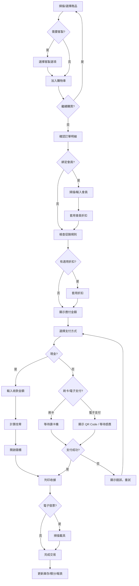
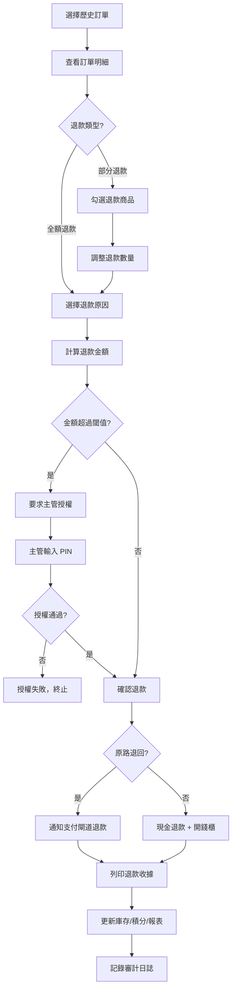
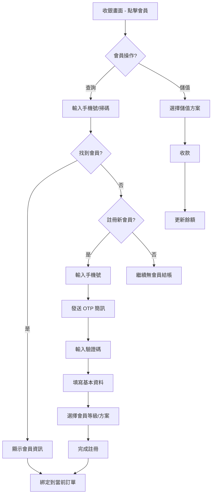
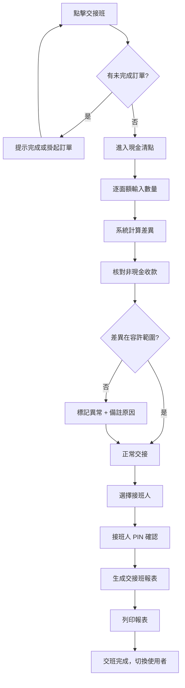
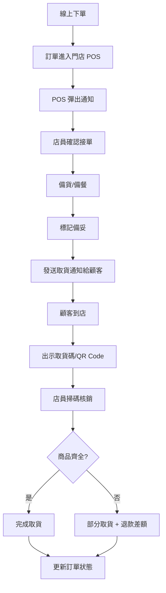

# POS 系統 UI/UX 設計提示詞集

> 本文檔提供可直接複製給其他 AI 工具（v0.dev、GPT-4o、Figma AI、Midjourney）的 UI/UX 設計提示詞。
> 每段提示詞獨立可用，複製一段即可生成對應畫面。

---

## 目錄

1. [設計系統 (Design System)](#1-設計系統-design-system)
2. [POS 收銀終端畫面 (Flutter/iPad)](#2-pos-收銀終端畫面)
3. [管理後台畫面 (React/Web)](#3-管理後台畫面)
4. [廚房 KDS 畫面](#4-廚房-kds-畫面)
5. [顧客自助 Kiosk 畫面](#5-顧客自助-kiosk-畫面)
6. [使用者流程圖 (User Flow)](#6-使用者流程圖)
7. [Wireframe 描述](#7-wireframe-描述)
8. [業態變體說明](#8-業態變體說明)

---

## 1. 設計系統 (Design System)

### 提示詞：設計系統基礎

```
設計一個企業級 POS（銷售時點情報系統）的完整設計系統（Design System），需包含以下內容：

**色彩系統**
- 主色調：深藍 #1A237E（信任、專業）
- 強調色：橙色 #FF6D00（行動呼籲、支付按鈕）
- 成功色：綠色 #2E7D32
- 警告色：琥珀 #FF8F00
- 錯誤色：紅色 #C62828
- 中性色階：#FAFAFA → #F5F5F5 → #E0E0E0 → #9E9E9E → #424242 → #212121
- 深色模式配色方案（背景 #121212、表面 #1E1E1E、卡片 #2C2C2C）
- 日間模式與夜間模式自動切換

**字型系統**
- 中文：Noto Sans TC（Regular 400、Medium 500、Bold 700）
- 英文/數字：Inter（tabular-nums for 價格對齊）
- 金額顯示：32-48px Bold，千分位逗號分隔
- 層級：H1 32px / H2 24px / H3 20px / Body 16px / Caption 12px
- 最小觸控文字 14px

**間距與格線**
- 基準單位 8px（4px 微調）
- 卡片圓角 12px、按鈕圓角 8px、輸入框圓角 6px
- 觸控目標最小 48x48px（POS 終端建議 56x56px）
- 邊距 16px（手機）/ 24px（平板）/ 32px（桌面）

**元件庫**
- 按鈕：Primary / Secondary / Ghost / Danger / Icon-only
- 輸入框：文字、數字鍵盤、搜尋、PIN 輸入
- 卡片：商品卡片（圖+名+價）、訂單卡片、統計卡片
- 數字鍵盤：0-9 大按鈕 + 退格 + 確認 + 小數點
- 狀態指示器：在線/離線圓點、訂單狀態標籤
- Toast / Snackbar：成功、錯誤、警告
- Modal：確認對話框、折扣輸入、備註輸入
- 底部抽屜（Bottom Sheet）：支付方式選擇、商品詳情

**觸控優化**
- 所有互動元素最小 48x48px
- 按鈕間距至少 8px 避免誤觸
- 長按操作提供觸覺回饋指示
- 滑動手勢：左滑刪除、右滑恢復

**Accessibility**
- WCAG 2.1 AA 對比度
- 支援螢幕閱讀器標籤
- 焦點狀態明確可見
- 支援鍵盤導航

**多語系**
- 繁體中文（主要）、簡體中文、英文、日文
- RTL 佈局支援預留
- 日期格式：YYYY/MM/DD、貨幣格式：NT$ 1,234

技術棧：Flutter (POS 終端 iPad/Android) + React with MUI v5 (管理後台 Web)
輸出格式：Figma 組件庫結構 + Token JSON
```

---

## 2. POS 收銀終端畫面

### 2-1. 登入 / PIN 輸入畫面

```
設計一個 POS 終端機的登入畫面（iPad 橫向 1194x834px），需求如下：

**畫面佈局**
- 全屏深色背景（#1A237E 漸層到 #0D1B6F）
- 中央區域白色卡片（圓角 16px，陰影 elevation 8）
- 卡片上方：公司 Logo + 門店名稱（如「信義旗艦店」）
- 卡片中央：員工頭像（圓形 80px）區域，下方顯示「請輸入 PIN 碼」
- 卡片下方：4-6 位 PIN 碼圓點指示器（● ● ○ ○ ○ ○）

**數字鍵盤**
- 3x4 佈局的大按鈕（每個 80x80px，圓角 12px）
- 1-9 排列，底行：空白 / 0 / 退格（←）
- 按鈕按壓動畫：輕微縮放 + 漣漪效果
- 數字字體 28px Bold

**快速切換**
- 底部橫向滾動條顯示已登入員工的頭像小圓（48px）
- 點擊頭像可快速切換到該員工的 PIN 輸入
- 當前選中員工頭像有藍色邊框高亮

**狀態資訊**
- 左上角：終端編號「T-001」+ 在線/離線狀態圓點
- 右上角：當前時間 HH:mm、日期
- PIN 錯誤時：卡片抖動動畫 + 紅色提示「PIN 碼錯誤，還剩 N 次機會」
- 鎖定狀態：顯示倒數計時器「帳號已鎖定，請等待 MM:SS」

**業態變體**
- 零售版：背景可自定義品牌色
- 餐飲版：增加「外場/內場」切換 Tab

技術棧：Flutter，觸控優化，支援離線模式
風格：現代簡約，高對比度，適合強光環境
```

### 2-2. 主收銀畫面

```
設計 POS 主收銀畫面（iPad 橫向 1194x834px），這是收銀員最常使用的核心畫面：

**整體佈局 — 三欄式**
- 左欄（寬 320px）：購物車 / 當前訂單
- 中欄（自適應）：商品格 / 分類瀏覽
- 右欄（寬 280px）：小計面板 + 快捷操作

**左欄 — 購物車**
- 頂部：訂單編號 #2024-0428-001 + 桌號/取餐號（餐飲版）
- 商品列表（可滾動）：
  - 每行：商品名（16px）+ 數量（可點擊 +/-）+ 小計金額（右對齊）
  - 左滑顯示「刪除」紅色按鈕
  - 點擊展開：備註、折扣、修改選項
- 底部固定：
  - 小計 / 稅額 / 折扣 / 總計（總計 28px Bold 橙色）
  - 「清除訂單」文字按鈕（灰色）

**中欄 — 商品區**
- 頂部：搜尋欄（放大鏡圖標 + 支援條碼/名稱搜尋）+ 掃碼按鈕
- 分類 Tab 列（橫向滾動）：全部 / 飲料 / 主餐 / 甜點 / 套餐 / 客製 ...
- 商品格（Grid 3-4 列）：
  - 每格：商品圖片（1:1 正方形）+ 名稱（2行截斷）+ 價格
  - 格子大小約 140x180px
  - 缺貨商品灰色遮罩 + 「已售完」標籤
  - 點擊加入購物車（帶彈跳動畫）
  - 長按顯示商品詳情 Bottom Sheet
- 支援清單模式（List View）切換

**右欄 — 操作面板**
- 會員資訊區：未綁定時顯示「掃碼/輸入會員」按鈕；已綁定顯示會員姓名+等級+積分
- 快捷按鈕區（2x3 格子）：
  - 折扣、備註、掛單、取單、分單、客製
- 支付按鈕（全寬大按鈕 56px 高，橙色）：「結帳 NT$ 1,234」
- 底部：功能列 — 交接班 / 開錢櫃 / 設定

**頂部導航列**
- 左：漢堡選單（展開側邊欄：歷史訂單、報表、設定）
- 中：門店名稱 + 當前班次
- 右：員工姓名 + 頭像 + 登出/鎖定

**離線指示**
- 離線時頂部出現黃色 Banner「離線模式 — 訂單將在連線後自動同步」
- 網路恢復後綠色 Banner 閃現「已恢復連線，同步中...」

技術棧：Flutter，觸控優化，60fps 動畫
風格：高效、低視覺干擾、資訊密度適中
```

### 2-3. 支付流程畫面

```
設計 POS 支付流程畫面（iPad 橫向 1194x834px），從主收銀畫面點擊「結帳」後進入：

**畫面佈局 — 左右分割**
- 左側（50%）：訂單摘要
- 右側（50%）：支付操作區

**左側 — 訂單摘要**
- 訂單明細列表（唯讀，灰色背景）
- 底部統計：
  - 小計：NT$ 1,080
  - 稅額（5%）：NT$ 54
  - 折扣：-NT$ 100（紅色）
  - 會員折扣：-NT$ 50（紅色）
  - 應收金額：NT$ 984（32px Bold）

**右側 — 支付操作**
- 支付方式選擇（大圖標按鈕 Grid 2x3）：
  - 現金（紙鈔圖標）
  - 信用卡（刷卡圖標）
  - LINE Pay（品牌 Logo）
  - 街口支付（品牌 Logo）
  - 悠遊卡（品牌 Logo）
  - 其他（+）
- 選擇「現金」後：
  - 數字鍵盤輸入收款金額
  - 快捷金額按鈕：NT$1000 / NT$500 / 剛好（精確金額）
  - 顯示找零金額：「找零 NT$ 16」（綠色大字）
- 選擇「信用卡」後：
  - 顯示「請刷卡/插卡/感應」動畫提示
  - 等待讀卡機回應
  - 成功/失敗狀態顯示
- 分段支付：
  - 「分段支付」Toggle 開關
  - 已收金額進度條
  - 多筆支付記錄列表

**完成支付後**
- 全屏成功動畫（綠色打勾 ✓）
- 收據選項：列印 / Email / SMS / 不需要
- 電子發票載具掃碼區
- 「下一位顧客」按鈕返回主收銀畫面

技術棧：Flutter，支援外接硬體（讀卡機、發票機、錢櫃）
風格：步驟清晰、高效、減少點擊次數
```

### 2-4. 退款/作廢流程畫面

```
設計 POS 退款與作廢操作畫面（iPad 橫向 1194x834px）：

**入口**
- 從歷史訂單列表選擇訂單 → 點擊「退款」或「作廢」

**畫面佈局**
- 頂部紅色警示欄：「⚠ 退款操作 — 請確認」
- 左側：原始訂單明細（唯讀）
  - 每個商品行帶核取方塊（可選擇部分退款）
  - 已選商品高亮
  - 退款數量調整（-/+）
- 右側：退款摘要 + 操作
  - 退款金額計算（自動更新）
  - 退款原因（必選下拉選單）：
    - 客戶要求 / 商品問題 / 操作錯誤 / 品質問題 / 其他
  - 退款方式：原路退回 / 現金退款
  - 備註輸入框

**主管授權**
- 退款金額超過設定閾值時，彈出「主管授權」Modal
- 主管 PIN 碼輸入區（與登入相同的數字鍵盤）
- 授權成功後顯示主管姓名 + 時間戳

**作廢（Void）**
- 僅限當日未結帳訂單
- 全額作廢，無需選擇商品
- 同樣需要原因 + 主管授權

**確認步驟**
- 紅色「確認退款」按鈕（需二次確認 Modal）
- 退款成功：顯示退款單號 + 列印退款收據選項
- 操作記錄自動寫入審計日誌

技術棧：Flutter
風格：紅色警示色調、操作不可逆的嚴謹感、防誤觸設計
```

### 2-5. 交接班 / X-Z Report 畫面

```
設計 POS 交接班與日結報表畫面（iPad 橫向 1194x834px）：

**交接班流程 — 三步驟精靈**

Step 1: 現金清點
- 面額表格：NT$1000 / $500 / $100 / $50 / $10 / $5 / $1
- 每行：面額圖片 + 數量輸入（數字鍵盤）+ 小計
- 底部：現金合計（自動加總）
- 與系統記錄差異：+/- 金額（差異為 0 時綠色，否則紅色）

Step 2: 非現金核對
- 信用卡筆數 / 金額
- 各電子支付筆數 / 金額
- 與系統記錄比對，差異標紅

Step 3: 確認與簽核
- 交接班摘要卡片：
  - 班次時間：08:00 - 16:00
  - 總營業額：NT$ 45,680
  - 現金：NT$ 23,400（系統）/ NT$ 23,350（清點）→ 差異 -NT$50
  - 非現金：NT$ 22,280
  - 訂單數：67 筆
  - 退款：2 筆 / NT$ 560
  - 折扣：NT$ 1,200
- 接班人選擇（員工下拉清單或 PIN 輸入）
- 備註欄
- 「完成交接」按鈕

**X Report（中間報表）**
- 不清零，僅查看當前班次統計
- 圖表：每小時營業額長條圖
- 熱銷商品 Top 10 列表
- 支付方式圓餅圖

**Z Report（日結報表）**
- 清零並封存
- 包含所有班次的合併統計
- 可列印完整日結報表
- 列印後鎖定，不可修改

技術棧：Flutter，支援熱感應印表機列印
風格：數據導向、表格清晰、差異醒目
```

---

## 3. 管理後台畫面

### 3-1. Dashboard 總覽

```
設計 POS 管理後台的 Dashboard 頁面（Web 桌面版 1440x900px），使用 React + MUI v5：

**頂部導航列（AppBar 64px）**
- 左：漢堡選單 + Logo + 系統名稱
- 中：門店切換下拉選單（多店管理時）
- 右：通知鈴鐺（Badge 紅點）+ 使用者頭像 + 登出

**左側導航（Drawer 280px，可收合到 72px）**
- 圖標 + 文字的導航項目：
  - Dashboard / 訂單管理 / 商品管理 / 庫存管理 / 會員管理
  - 報表中心 / 門店管理 / 員工管理 / 促銷管理 / 系統設定
- 當前頁面高亮
- 底部：收合/展開按鈕

**主內容區 — Dashboard**
- 頂部日期範圍選擇器：今日 / 本週 / 本月 / 自訂
- 第一行 — KPI 卡片（4 個，等寬）：
  - 今日營業額 NT$ 128,450（↑ 12.5% vs 昨日）
  - 訂單數 234 筆（↑ 8%）
  - 客單價 NT$ 549（↓ 2.1%）
  - 來客數 198 人
- 第二行 — 圖表區（2 欄）：
  - 左：營業額趨勢折線圖（近 7 天/30 天，可切換）
  - 右：支付方式分佈圓餅圖
- 第三行 — 圖表區（2 欄）：
  - 左：每小時交易量長條圖（找出尖峰時段）
  - 右：熱銷商品排行 Top 10（水平長條圖）
- 第四行 — 表格區：
  - 左：最近訂單列表（訂單號、金額、支付方式、時間、狀態）
  - 右：庫存警示列表（低庫存商品名稱、剩餘數量、建議補貨量）

**即時通知側邊欄（右側 Drawer，按需展開）**
- 即時訂單通知
- 庫存警示
- 終端機離線警報
- 員工打卡通知

色彩：白色背景 + 藍灰色側邊欄，數據卡片用漸層背景
圖表庫：Recharts 或 Chart.js
響應式：支援 1024px 以上
```

### 3-2. 商品管理

```
設計 POS 管理後台的商品管理頁面（Web 1440x900px），React + MUI v5：

**頁面結構**
- 頂部：標題「商品管理」+ 新增商品按鈕（Primary）+ 批量匯入按鈕
- 過濾列：分類下拉 / 狀態（上架/下架/停售）/ 搜尋框 / 排序方式
- 切換檢視模式：表格（Table）/ 卡片格（Grid）

**表格模式**
- 欄位：商品圖片（縮圖 48px）/ 商品名稱 / SKU / 分類 / 售價 / 成本 / 庫存 / 狀態 / 操作
- 多選核取方塊（批量操作：上架、下架、刪除、調價）
- 行內快速編輯：點擊價格可直接修改
- 分頁：每頁 20/50/100 筆

**卡片格模式**
- 商品卡片：圖片（16:9）+ 名稱 + 價格 + 庫存 + 狀態標籤
- 拖拽排序（Drag & Drop 調整顯示順序）

**新增/編輯商品 — 側邊抽屜或 Modal**
- 基本資訊 Tab：名稱、描述、分類（可多選）、品牌
- 價格 Tab：售價、成本價、特價、會員價、批量定價
- 庫存 Tab：SKU、條碼、追蹤庫存開關、安全庫存量
- 媒體 Tab：拖拽上傳圖片（最多 5 張）、排序
- 變體 Tab（服飾業態）：尺寸/顏色/規格 組合生成
- 選項 Tab（餐飲業態）：加料、大小、溫度、甜度 自定義選項組
- SEO/進階 Tab：稅務分類、重量、自訂屬性

**分類管理**
- 樹狀結構（Tree View）
- 拖拽調整層級和順序
- 每個分類：名稱、圖示、排序權重、狀態

風格：乾淨的白色 + 卡片陰影，操作高效
```

### 3-3. 庫存管理

```
設計 POS 管理後台的庫存管理頁面（Web 1440x900px），React + MUI v5：

**頁面 Tab 導航**
- 庫存總覽 / 進貨單 / 調撥單 / 盤點 / 庫存警示

**庫存總覽 Tab**
- KPI 卡片：總 SKU 數 / 庫存總值 / 低庫存項目數 / 待盤點項目
- 表格：商品名 / SKU / 分類 / 當前庫存 / 安全庫存 / 狀態（正常/低庫存/缺貨）
- 庫存狀態用色彩標籤：綠色正常、黃色低庫存、紅色缺貨
- 搜尋 + 分類過濾 + 狀態過濾

**進貨單 Tab**
- 進貨單列表：單號、供應商、日期、狀態（待確認/已入庫）、金額
- 新增進貨單：
  - 供應商選擇（Autocomplete）
  - 商品明細表格：商品搜尋 + 數量 + 進價 + 小計
  - 附件上傳（發票照片）
  - 確認入庫後自動更新庫存

**調撥單 Tab**（多店版）
- 調出門店 → 調入門店
- 商品明細 + 數量
- 狀態流程：待審核 → 已出庫 → 運送中 → 已入庫

**盤點 Tab**
- 建立盤點任務：選擇盤點範圍（全部/分類/區域）
- 盤點輸入：系統數量 vs 實際數量 → 差異自動計算
- 支援掃碼盤點（連接掃碼槍）
- 盤點報告生成

風格：數據密集但結構清晰，用色彩區分狀態
```

### 3-4. 會員管理

```
設計 POS 管理後台的會員管理頁面（Web 1440x900px），React + MUI v5：

**頁面 Tab**
- 會員列表 / 等級設定 / 積分規則 / 儲值管理 / 數據分析

**會員列表 Tab**
- 搜尋欄：手機號 / 姓名 / 會員編號 / Email
- 表格：頭像 / 姓名 / 手機 / 等級（標籤色彩）/ 積分 / 儲值餘額 / 註冊日期 / 最後消費
- 點擊展開會員詳情側邊抽屜：
  - 基本資訊 + 編輯
  - 消費記錄時間軸
  - 積分變動記錄
  - 儲值記錄
  - 標籤管理（VIP、黑名單、生日月等）

**等級設定 Tab**
- 等級卡片（可視化）：
  - 普通會員（灰）→ 銀卡（銀）→ 金卡（金）→ 鑽石（紫）
  - 每級：升級條件（消費金額/次數）、折扣比例、積分倍率
- 拖拽調整等級順序

**積分規則 Tab**
- 規則列表：每消費 NT$1 得 1 點 / 生日雙倍 / 指定商品加倍
- 兌換規則：100 點 = NT$1 折抵
- 積分到期設定

**數據分析 Tab**
- 會員增長趨勢圖
- 消費頻率分佈圖
- RFM 分析矩陣（Recency, Frequency, Monetary）
- 會員等級分佈圓餅圖

風格：CRM 風格，客戶導向的暖色調
```

### 3-5. 報表中心

```
設計 POS 管理後台的報表中心頁面（Web 1440x900px），React + MUI v5：

**頁面結構**
- 左側：報表分類導航
  - 營業報表 / 商品報表 / 會員報表 / 員工報表 / 財務報表
- 右側：報表內容區

**營業報表**
- 日報/週報/月報/年報 Tab 切換
- 營業額趨勢圖（折線）+ 同期比較
- 明細表格：日期、訂單數、營業額、退款額、淨額、客單價
- 匯出按鈕：Excel / PDF / CSV

**商品報表**
- 銷售排行榜：Top 20 暢銷品（長條圖 + 表格）
- 滯銷品列表：30 天零銷售
- 商品分類營業佔比（圓餅圖）
- 商品毛利分析：售價 vs 成本 vs 毛利率
- 時段銷售熱力圖（X 軸小時，Y 軸星期）

**員工報表**
- 收銀員業績排名：銷售額、訂單數、客單價
- 出勤統計：遲到/早退/請假
- 操作日誌：退款/作廢/折扣 操作次數

**財務報表**
- 損益表（P&L）概覽
- 現金流報表
- 稅務報表（發票統計）
- 支付方式手續費明細

**通用功能**
- 日期範圍選擇器（DateRangePicker）
- 門店篩選（多選，多店模式）
- 自動刷新 Toggle
- 排程報表（設定每日/週/月自動發送 Email）
- 圖表支援全屏檢視

圖表庫：Recharts
風格：數據儀表板風格，白底 + 清晰圖表 + 豐富的篩選器
```

### 3-6. 門店管理

```
設計 POS 管理後台的門店管理頁面（Web 1440x900px），React + MUI v5：

**頁面結構**
- 頂部：「門店管理」標題 + 新增門店按鈕
- 檢視切換：列表 / 地圖 / 卡片

**列表模式**
- 表格：門店名稱 / 門店代碼 / 區域 / 地址 / 狀態 / 終端機數 / 今日營業額 / 操作
- 狀態標籤：營業中（綠）/ 休息中（黃）/ 停業（紅）

**地圖模式**
- 嵌入 Google Maps / OpenStreetMap
- 門店位置圖釘（色彩依狀態區分）
- 點擊圖釘彈出門店摘要卡片

**卡片模式**
- 門店卡片：門店照片 + 名稱 + 狀態 + 今日 KPI（營業額、訂單數）

**門店詳情頁（點擊進入）**
- Tab 導航：基本資訊 / 終端機 / 員工 / 營業時間 / 收據設定
- 基本資訊：名稱、代碼、區域、地址、電話、Email、時區、幣別、稅率
- 終端機列表：終端代碼、設備型號、狀態（在線/離線）、最後心跳時間、IP
- 員工列表：姓名、角色、是否主要門店、指派日期
- 營業時間：每日營業/休息時間設定（拖拽時間條）
- 收據設定：收據頭/尾自定義、預覽列印效果

風格：企業管理風格，資訊密度中等
```

### 3-7. 員工/排班管理

```
設計 POS 管理後台的員工與排班管理頁面（Web 1440x900px），React + MUI v5：

**頁面 Tab**
- 員工列表 / 排班表 / 打卡記錄 / 績效

**員工列表 Tab**
- 表格：照片 / 姓名 / 員工編號 / 職位 / 門店 / 狀態 / 入職日期
- 新增員工表單：基本資訊 + 門店指派（可多店）+ 角色權限

**排班表 Tab**
- 週曆檢視（類似 Google Calendar 週視圖）
- X 軸：週一至週日
- Y 軸：員工姓名
- 色彩方塊表示班次：早班（藍）/ 中班（綠）/ 晚班（紫）
- 拖拽建立/調整班次
- 點擊班次方塊編輯：開始時間、結束時間、門店、角色
- 自動衝突檢測（同時段重複排班紅色警示）
- 範本功能：儲存常用排班樣板，一鍵套用

**打卡記錄 Tab**
- 表格：日期 / 員工 / 排班時間 / 實際打卡時間 / 遲到/早退標記
- 異常記錄高亮（遲到 > 10 分鐘紅色）

**績效 Tab**
- 員工業績排名表
- 個人營業額趨勢圖
- 出勤率統計

風格：行事曆風格、拖拽互動、色彩豐富但不雜亂
```

### 3-8. 促銷管理

```
設計 POS 管理後台的促銷管理頁面（Web 1440x900px），React + MUI v5：

**頁面結構**
- Tab：進行中 / 即將開始 / 已結束 / 建立促銷

**促銷列表**
- 卡片式列表：
  - 促銷名稱 + 類型標籤（折扣/滿減/買贈/套餐/限時）
  - 時間範圍（進度條顯示已進行百分比）
  - 適用門店 / 適用商品數
  - 使用次數 / 預算消耗
  - 狀態：啟用/暫停/已結束
  - 操作：編輯 / 暫停 / 複製 / 刪除

**建立促銷 — 步驟精靈（Stepper）**
Step 1: 基本設定
  - 促銷名稱、描述、類型選擇（大圖標選擇器）
Step 2: 規則設定
  - 折扣類型：百分比 / 固定金額 / 買 X 送 Y / 滿額減 / 第 N 件折扣
  - 條件：最低消費金額、最低數量、指定商品/分類
  - 可疊加設定
Step 3: 適用範圍
  - 門店選擇（全部/指定門店）
  - 會員限制（全部/指定等級）
  - 使用次數限制（每人/總計）
Step 4: 時間設定
  - 開始/結束日期時間
  - 週期性設定（每週幾 / 每日特定時段）
Step 5: 預覽確認
  - 促銷規則摘要
  - 預估影響商品數
  - 模擬計算範例

風格：行銷工具風格、引導式步驟、預覽直觀
```

---

## 4. 廚房 KDS 畫面

```
設計廚房顯示系統（KDS）畫面（適用 15-21 吋觸控螢幕，1920x1080px）：

**整體佈局 — 看板式（Kanban）**
- 4-6 列看板（自適應螢幕寬度）
- 每列代表一張訂單卡片
- 從左到右按接單時間排序（最早的在左）

**訂單卡片**
- 頂部色帶：依類型著色
  - 內用：藍色 + 桌號「桌 A5」
  - 外帶：橙色 + 取餐號「#087」
  - 外送：紫色 + 平台名「UberEats」+ 預計取餐時間
- 中央：商品列表
  - 每行：數量 x 商品名稱
  - 客製修改用黃色底色高亮（如「少冰、去糖、加辣」）
  - 已完成項目打勾 + 灰色
- 底部：
  - 接單時間 + 已等候時間計時器
  - 時間色彩：< 5min 綠色 / 5-10min 黃色 / > 10min 紅色閃爍
  - 「完成」按鈕（大按鈕，適合戴手套點擊）

**頂部狀態列**
- 當前待處理訂單數
- 平均出餐時間
- 已超時訂單數（紅色 Badge）

**互動操作**
- 點擊商品行 → 標記該項完成
- 點擊「完成」按鈕 → 整張訂單完成，卡片滑出
- 長按訂單 → 召回（恢復到待處理）
- 支援「催單」閃爍動畫（前台催單時觸發）

**聲音提示**
- 新訂單到達：叮咚聲
- 訂單超時：警報聲
- 催單：連續嗶嗶聲

**螢幕分區模式（可選）**
- 左半區：備餐中
- 右半區：已完成（最近 10 筆）

技術棧：Flutter 或 React（Web View）
風格：高對比、大字體（最小 18px）、適合油膩手指觸控、亮色主題避免暗處閱讀困難
```

---

## 5. 顧客自助 Kiosk 畫面

```
設計顧客自助點餐 Kiosk 畫面（直立式觸控螢幕 1080x1920px，9:16 直向）：

**歡迎畫面**
- 全屏品牌背景（餐廳照片或品牌主視覺）
- 中央：「點擊開始點餐」大按鈕（含觸控手勢動畫提示）
- 語言選擇：繁中 / 英文 / 日文（右上角小按鈕）
- 用餐方式選擇：「內用」/「外帶」兩個大卡片

**分類瀏覽畫面**
- 頂部：品牌 Logo + 訂單進度指示（選餐 → 確認 → 支付 → 完成）
- 左側窄欄（120px）：分類列表（垂直排列，大圖標 + 文字）
  - 推薦 / 套餐 / 主餐 / 配菜 / 飲料 / 甜點
  - 當前分類高亮
- 右側主區域：商品卡片 Grid（2-3 列）
  - 卡片：商品大圖（3:2）+ 名稱 + 價格 + 「加入」按鈕
  - 人氣商品「🔥 人氣」標籤
  - 新品「NEW」標籤
  - 售完灰色遮罩

**商品客製畫面（Bottom Sheet 或全屏）**
- 商品大圖 + 名稱 + 描述
- 客製選項（單選/多選）：
  - 大小：小 / 中 / 大（+NT$10 / +NT$20）
  - 溫度：冰 / 少冰 / 去冰 / 溫 / 熱
  - 甜度：全糖 / 少糖 / 半糖 / 微糖 / 無糖
  - 加料：珍珠 +NT$10 / 椰果 +NT$10 / 布丁 +NT$15
- 數量選擇（-/1/+）
- 備註輸入（選填）
- 金額小計
- 「加入購物車」大按鈕

**購物車畫面（右側滑出或底部上推）**
- 已選商品列表（名稱 + 客製 + 數量 + 金額）
- 左滑刪除
- 總計金額（大字）
- 「繼續點餐」+ 「前往結帳」按鈕

**支付畫面**
- 選擇支付方式：信用卡 / 行動支付 QR Code / 現金（如有）
- QR Code 支付：螢幕顯示 QR Code + 倒數計時
- 刷卡：動畫指引「請將信用卡靠近感應區」
- 付款成功：大大的 ✓ + 取餐號碼（超大字 72px）「#087」

**完成畫面**
- 取餐號碼 + 預估等候時間
- 「列印收據」/「不需收據」
- 10 秒後自動返回歡迎畫面

技術棧：Flutter（Kiosk Mode）或 React（Chrome Kiosk）
風格：明亮、親切、大按鈕（最小 64x64px）、大字體、適合各年齡層
無障礙：底部按鈕區域在輪椅使用者可觸及高度
```

---

## 6. 使用者流程圖

### 6-1. 結帳流程 (Checkout Flow)



### 6-2. 退款流程 (Refund Flow)



### 6-3. 會員註冊/查詢流程



### 6-4. 交接班流程



### 6-5. BOPIS 流程 (Buy Online Pick-up In Store)



---

## 7. Wireframe 描述

### 7-1. POS 主收銀畫面 Wireframe

```
為以下 POS 主收銀畫面生成 wireframe（iPad 橫向 1194x834px）：

佈局：三欄式
┌──────────────────────────────────────────────────┐
│  [≡] 信義旗艦店 - 早班          王小明 [🔒] [⚙] │  ← 頂部導航 64px
├────────┬─────────────────────┬───────────┤
│        │ [🔍 搜尋商品...]  [📷]│           │
│ 購物車  │ [全部][飲料][主餐]... │  會員區    │
│ 320px  │                     │  280px    │
│        │ ┌───┐ ┌───┐ ┌───┐ │           │
│ #001   │ │ 📦│ │ 📦│ │ 📦│ │ [掃碼綁定] │
│        │ │美式│ │拿鐵│ │紅茶│ │           │
│ 美式 x1│ │$120│ │$150│ │$80│ │ ┌──┐┌──┐ │
│    $120│ │    │ │    │ │   │ │ │折扣││備註│ │
│ 拿鐵 x2│ ├───┤ ├───┤ ├───┤ │ ├──┤├──┤ │
│    $300│ │ 📦│ │ 📦│ │ 📦│ │ │掛單││取單│ │
│        │ │三明│ │沙拉│ │蛋糕│ │ ├──┤├──┤ │
│────────│ │$180│ │$160│ │$120│ │ │分單││客製│ │
│小計 $420│ │    │ │    │ │   │ │ └──┘└──┘ │
│稅   $21│ └───┘ └───┘ └───┘ │           │
│折扣  $0│                     │ ┌────────┐│
│────────│                     │ │ 結帳    ││
│總計$441│                     │ │ NT$441  ││
│[清除]  │                     │ └────────┘│
│        │                     │ [交接][錢櫃]│
└────────┴─────────────────────┴───────────┘

生成高保真 wireframe，灰階即可，標注互動熱區。
```

### 7-2. 管理後台 Dashboard Wireframe

```
為以下管理後台 Dashboard 生成 wireframe（Web 1440x900px）：

佈局：
┌────────────────────────────────────────────────┐
│ [≡] Logo 企業名稱    [門店:信義店 ▼]  🔔 👤    │ ← AppBar 64px
├──────┬─────────────────────────────────────────┤
│      │  Dashboard          [今日 ▼] 2024/04/28 │
│ 📊   │  ┌────────┬────────┬────────┬────────┐  │
│ Dash │  │營業額   │訂單數   │客單價   │來客數   │  │
│      │  │$128,450│ 234筆  │ $549   │ 198人  │  │
│ 📋   │  │↑12.5%  │↑8%     │↓2.1%  │↑5%     │  │
│ 訂單 │  └────────┴────────┴────────┴────────┘  │
│      │  ┌──────────────┬──────────────┐        │
│ 📦   │  │ 營業額趨勢    │ 支付方式分佈   │        │
│ 商品 │  │ [折線圖]      │ [圓餅圖]      │        │
│      │  │              │              │        │
│ 📊   │  ├──────────────┼──────────────┤        │
│ 庫存 │  │ 每小時交易量   │ 熱銷 Top 10  │        │
│      │  │ [長條圖]      │ [水平長條]    │        │
│ 👥   │  │              │              │        │
│ 會員 │  ├──────────────┼──────────────┤        │
│      │  │ 最近訂單列表   │ 庫存警示列表   │        │
│ 📈   │  │ [表格]        │ [表格]        │        │
│ 報表 │  └──────────────┴──────────────┘        │
│      │                                         │
│ 🏪   │                                         │
│ 門店 │                                         │
├──────┤                                         │
│ [◁▷] │                                         │
└──────┴─────────────────────────────────────────┘

生成高保真 wireframe，包含真實假資料。
```

---

## 8. 業態變體說明

### 零售業態 vs 餐飲業態差異

```
在設計上述所有 POS 畫面時，請注意以下業態差異並提供變體設計：

**零售業態特點**
- 商品以條碼掃描為主（掃碼槍），手動搜尋為輔
- 無客製選項，但有尺寸/顏色等 SKU 變體
- 庫存管理是核心功能
- 不需要 KDS 廚房顯示
- 不需要桌號管理
- 重視退換貨流程（含換貨）
- 需要比價、批量折扣功能

**餐飲業態特點**
- 商品以觸控選擇為主，無條碼
- 大量客製選項（甜度、冰量、加料）
- 桌號 / 取餐號管理
- KDS 廚房顯示系統必備
- 外送平台整合（UberEats、foodpanda）
- 菜單時段管理（早餐/午餐/下午茶/晚餐）
- 座位管理（翻桌率）

**共通需求**
- PIN 快速登入
- 會員系統
- 多種支付方式
- 交接班報表
- 離線模式支援
- 多語系

請為每個畫面提供零售版和餐飲版兩個變體（如果差異顯著的話）。
```

---

## 附錄：提示詞使用建議

| AI 工具 | 適用提示詞 | 輸出格式 |
|---------|-----------|---------|
| v0.dev | 第 2-5 節的畫面設計提示詞 | React/Tailwind 程式碼 |
| GPT-4o | 第 1 節設計系統 + 第 7 節 Wireframe | 文字描述 + 圖片 |
| Figma AI | 第 1 節設計系統 + 第 7 節 Wireframe | Figma 元件 |
| Midjourney | 「POS terminal UI, modern, iPad, touch-optimized, dark theme, --ar 16:9」 | 概念圖 |
| Claude | 第 6 節流程圖（直接渲染 Mermaid）| 流程圖 + 說明 |
| Cursor / Copilot | 第 2-5 節 + 指定技術棧 | 完整元件程式碼 |

### 複製提示詞時的注意事項

1. **每段獨立使用** — 不需要全部複製，選擇需要的畫面即可
2. **加上技術棧** — 確認目標 AI 支援的技術棧（Flutter / React / HTML）
3. **指定尺寸** — 明確告知螢幕尺寸和方向
4. **業態前綴** — 在提示詞開頭加上「這是一個零售/餐飲 POS 系統」
5. **品牌替換** — 將範例中的品牌名、門店名替換為實際品牌
