# POS 系統模塊化需求文檔 (POS System Modular Requirements Document)

> **版本**: v1.0  
> **建立日期**: 2026-04-07  
> **基於**: 企業模塊化組件系統企畫書  
> **狀態**: 初版草案

---

## 一、專案概述 (Project Overview)

### 1.1 專案背景

本 POS 系統是「企業模塊化組件系統」下的第一個實際應用專案。系統採用模塊化架構，透過 Feature Toggle 功能開關實現快速客製化，使同一套程式碼基底可服務不同業態的客戶——從小型咖啡廳到連鎖餐飲集團。

### 1.2 適用業態

| 業態 | 說明 | 典型場景 |
|------|------|---------|
| 零售門市 | 服飾店、超商、3C 賣場、書店 | 條碼掃描結帳、庫存管理 |
| 速食餐飲 | 速食店、飲料店、食物卡車 | 快速點餐、廚房出單 |
| 正式餐廳 | 中西餐廳、火鍋店、居酒屋 | 桌位管理、分單結帳、出餐管理 |
| 咖啡廳 | 咖啡館、甜品店、麵包坊 | 客製化飲品、會員儲值 |
| 連鎖總部 | 連鎖品牌總部管理 | 多門店報表、統一庫存、促銷下發 |

### 1.3 核心策略

1. **模塊化開發 (Modular Development)**: 功能按模組拆分，每個模組獨立開發、測試、啟停
2. **Feature Toggle (功能開關)**: 透過 `@ConditionalOnProperty` 控制模組啟用，不同客戶組合不同模組
3. **單一資料庫 (Single DB)**: 所有模組共用一個 PostgreSQL，以表前綴區分
4. **軟刪除 (Soft Delete)**: 所有商業資料使用 `deleted_at` 標記刪除，確保歷史資料完整性
5. **離線優先 (Offline First)**: POS 終端支援斷線運作，網路恢復後自動同步

### 1.4 技術棧（繼承母體系統）

| 層級 | 技術選型 | 說明 |
|------|---------|------|
| 後端框架 | Spring Boot 3.x (Java 21) | 單一 JAR，內含所有啟用模組 |
| ORM | JPA / Hibernate | 資料存取層 |
| 排程 | Quartz Scheduler | 定時任務（日結、同步） |
| 前端 Web | React + TypeScript + Vite + MUI + Zustand | 管理後台 |
| 前端 POS 終端 | Flutter (Dart) | iPad / Android 平板收銀 |
| 資料庫 | PostgreSQL | 單一資料庫，表以前綴區分 |
| 快取 | Redis | Session、商品快取、即時庫存 |
| 容器化 | Docker + Docker Compose | 4 容器部署 |
| 反向代理 | Nginx | 前後端路由 |
| DB 遷移 | Flyway | 版本化遷移腳本 |

---

## 二、系統架構 (System Architecture)

### 2.1 部署拓撲

```
┌────────────────────── 客戶端 ──────────────────────┐
│  POS 終端 (Flutter/iPad)  |  管理後台 (React/Web)  │
│  + 離線 SQLite 本地儲存    |  + 報表與設定管理       │
└──────────────┬─────────────────────┬───────────────┘
               │                     │
┌──────────────▼─────────────────────▼───────────────┐
│          Docker: frontend (Nginx)                   │
│    靜態檔案 + 反向代理 /api → backend                │
└──────────────────────┬─────────────────────────────┘
                       │
┌──────────────────────▼─────────────────────────────┐
│          Docker: backend (Spring Boot)              │
│    單一 JAR，內含所有啟用的 POS 業務模組              │
│    核心POS | 商品 | 支付 | 庫存 | 會員 | 稅務 | ... │
│    + WebSocket (廚房顯示、即時通知)                   │
└──────────────────────┬─────────────────────────────┘
                       │
┌──────────────────────▼─────────────────────────────┐
│   Docker: postgres          Docker: redis           │
│   單一資料庫 (pos_ 前綴)     快取 + Session + 即時庫存 │
└─────────────────────────────────────────────────────┘
```

### 2.2 模組層次圖

```
┌─────────────────────────────────────────────────────────────┐
│                    module-common (共用基礎)                   │
│  BaseEntity | ApiResponse | JWT | RBAC | 工具類 | Feature Toggle │
└──────────────────────────┬──────────────────────────────────┘
                           │
┌──────────────────────────▼──────────────────────────────────┐
│              第一層：複用母體模組 (Reused Modules)              │
│  module-auth | module-organization | module-workflow         │
│  module-notification | module-audit | module-system          │
│  module-report                                               │
└──────────────────────────┬──────────────────────────────────┘
                           │
┌──────────────────────────▼──────────────────────────────────┐
│              第二層：擴展模組 (Extended Modules)               │
│  module-pos-inventory (擴展自 module-inventory)               │
│  module-pos-crm (擴展自 module-crm)                          │
└──────────────────────────┬──────────────────────────────────┘
                           │
┌──────────────────────────▼──────────────────────────────────┐
│              第三層：POS 專屬模組 (POS-Specific Modules)       │
│  module-pos-core | module-pos-product | module-pos-payment   │
│  module-pos-tax | module-pos-staff | module-pos-promotion    │
│  module-pos-printing | module-pos-sync | module-pos-hardware │
│  module-pos-kitchen | module-pos-table | module-pos-delivery │
│  module-pos-supplier | module-pos-reservation                │
└─────────────────────────────────────────────────────────────┘
```

### 2.3 Feature Toggle 配置

```yaml
# application.yml - POS 模組開關
modules:
  # 母體複用模組（POS 必啟）
  auth: true              # 認證授權 — 必啟
  organization: true      # 組織架構 — 必啟
  workflow: true          # 審批流程 — 退款/作廢審批
  notification: true      # 通知系統 — 訂單/庫存通知
  audit: true             # 稽核日誌 — 所有操作紀錄
  system: true            # 系統設定 — 全域設定
  report: true            # 報表分析 — 營運報表

  # POS 核心模組（必啟）
  pos-core: true          # 核心交易
  pos-product: true       # 商品管理
  pos-payment: true       # 支付處理
  pos-inventory: true     # 庫存管理
  pos-tax: true           # 稅務發票

  # POS 常用模組（依需求啟用）
  pos-crm: true           # 會員管理
  pos-staff: true         # 排班管理
  pos-promotion: true     # 促銷引擎
  pos-printing: true      # 列印管理
  pos-sync: true          # 資料同步
  pos-hardware: true      # 硬體管理

  # POS 進階模組（依業態啟用）
  pos-kitchen: false      # 廚房顯示 — 僅餐飲業
  pos-table: false        # 桌位管理 — 僅內用餐廳
  pos-delivery: false     # 外送外帶 — 僅外送業者
  pos-supplier: false     # 供應商管理 — 選配

  # POS 特殊場景模組
  pos-reservation: false  # 預約系統 — 僅餐廳
```

---

## 三、模組優先級總覽 (Module Priority Overview)

### 全部 23 個模組

| 優先級 | 模組代碼 | 模組名稱 | 來源 | 適用業態 |
|--------|---------|---------|------|---------|
| **P0** | module-auth | 認證與授權 | 複用+擴展 | 全部 |
| **P0** | module-organization | 組織架構與門店管理 | 複用+擴展 | 全部 |
| **P0** | module-pos-core | 核心 POS 交易與結帳 | 新建 | 全部 |
| **P0** | module-pos-product | 商品與菜單管理 | 新建 | 全部 |
| **P0** | module-pos-payment | 支付管理 | 新建 | 全部 |
| **P0** | module-pos-inventory | 全通路庫存同步 | 擴展 | 全部 |
| **P0** | module-pos-tax | 稅務與電子發票 | 新建 | 全部 |
| **P1** | module-pos-crm | CRM 會員與忠誠度管理 | 擴展 | 全部 |
| **P1** | module-pos-staff | 排班與班次管理 | 新建 | 全部 |
| **P1** | module-pos-promotion | 促銷與優惠券引擎 | 新建 | 全部 |
| **P1** | module-pos-printing | 列印管理 | 新建 | 全部 |
| **P1** | module-pos-sync | 資料同步與備份 | 新建 | 全部 |
| **P1** | module-pos-hardware | 硬體與周邊管理 | 新建 | 全部 |
| **P1** | module-workflow | 審批流程引擎 | 複用 | 全部 |
| **P1** | module-notification | 通知系統 | 複用 | 全部 |
| **P1** | module-report | 報表與數據分析 | 複用 | 全部 |
| **P1** | module-audit | 稽核日誌 | 複用 | 全部 |
| **P1** | module-system | 系統設定 | 複用 | 全部 |
| **P2** | module-pos-kitchen | 廚房顯示系統 (KDS) | 新建 | 餐飲業 |
| **P2** | module-pos-table | 桌位管理 | 新建 | 內用餐廳 |
| **P2** | module-pos-delivery | 外送與外帶管理 | 新建 | 餐飲/零售 |
| **P2** | module-pos-supplier | 供應商與採購管理 | 新建 | 全部 |
| **P3** | module-pos-reservation | 預約系統 | 新建 | 餐廳 |

---

## 四、各模組詳細需求 (Detailed Module Requirements)

---

### 模組 01：認證與授權 (module-auth) — P0 ｜複用+擴展

> 複用母體系統 module-auth，新增 POS 專屬的 PIN 登入與快速切換功能。

#### 功能列表

| 功能 | 說明 |
|------|------|
| 帳號密碼登入 | BCrypt/Argon2 驗證，用於管理後台登入 |
| JWT Token | Access Token (15min) + Refresh Token (7days) |
| PIN 碼快速登入 | POS 終端使用 4-6 位 PIN 碼快速登入，適合門市多人共用機台 |
| 快速切換帳號 | 不需完全登出，輸入 PIN 碼即可切換當前操作員 |
| 店長權限覆蓋 | 需要授權的操作（退款、作廢、折扣）由店長刷卡或輸入密碼授權 |
| 基於角色的存取控制 (RBAC) | 預設 POS 角色定義 |
| 登入失敗鎖定 | PIN 碼連續錯誤 5 次鎖定 30 分鐘 |
| 終端機綁定認證 | POS 終端機需先註冊綁定，防止未授權裝置存取系統 |
| 自動鎖屏 | 閒置超時自動鎖定螢幕，需重新輸入 PIN 解鎖 |

#### POS 預設角色

| 角色 | 權限範圍 |
|------|---------|
| `CASHIER` (收銀員) | 結帳、加入購物車、基本查詢、自身交接班 |
| `SHIFT_MANAGER` (值班主管) | 收銀員權限 + 退款授權（限額內）、折扣授權、作廢訂單、查看當班報表 |
| `STORE_MANAGER` (店長) | 值班主管權限 + 無限額退款、修改商品價格、查看全店報表、管理員工排班 |
| `AREA_MANAGER` (區域經理) | 店長權限 + 跨門店報表、調撥審批 |
| `ADMIN` (系統管理員) | 全部權限 + 系統設定、模組開關、全域配置 |

#### 資料表

| 表名 | 說明 |
|------|------|
| `auth_users` | 使用者帳號（複用母體） |
| `auth_roles` | 角色定義（複用母體，新增 POS 角色） |
| `auth_permissions` | 權限定義（複用母體，新增 POS 權限） |
| `auth_role_permissions` | 角色權限映射 |
| `auth_user_roles` | 使用者角色映射 |
| `auth_pin_codes` | **POS 擴展** — user_id, pin_hash, terminal_type, active |
| `auth_terminal_tokens` | **POS 擴展** — terminal_id, token_hash, registered_at, expires_at |
| `auth_login_logs` | 登入日誌（複用母體） |

#### Spring Event

- **發布**: `UserLoggedInEvent`, `UserSwitchedEvent`, `ManagerOverrideEvent`
- **消費**: 無

#### Feature Toggle

```yaml
pos.auth.pin-login: true          # 啟用 PIN 碼登入
pos.auth.quick-switch: true       # 啟用快速切換
pos.auth.auto-lock-minutes: 5     # 自動鎖屏時間
pos.auth.manager-override: true   # 啟用店長權限覆蓋
```

---

### 模組 02：組織架構與門店管理 (module-organization) — P0 ｜複用+擴展

> 複用母體系統 module-organization，新增門店、區域、收銀終端管理。

#### 功能列表

| 功能 | 說明 |
|------|------|
| 公司/品牌管理 | 集團或品牌層級的基本資料設定 |
| 區域管理 | 區域劃分（北區、中區、南區等），區域經理指派 |
| 門店管理 | 建立與管理實體門市資料——地址、營業時間、電話、時區、幣別 |
| 門店營業設定 | 每間門店的稅務設定、預設支付方式、收據格式等 |
| 員工管理 | 員工基本資料、歸屬門店、角色指派 |
| 員工門店歸屬 | 員工綁定至特定門店，限制只能登入所屬門店 POS |
| 員工多門店支援 | 支援員工隸屬多間門店（兼職人員、支援人力） |
| 收銀機 / 終端機管理 | 登記每台 POS 終端（Terminal ID）、綁定門店、硬體設定檔 |
| 終端機狀態監控 | 追蹤終端機的在線狀態、最後心跳時間、版本資訊 |
| 組織圖 | 視覺化：公司 → 區域 → 門店 → 終端機 層級架構 |

#### 資料表

| 表名 | 說明 |
|------|------|
| `org_companies` | 公司/品牌資料（複用母體） |
| `org_departments` | 部門（複用母體） |
| `org_employees` | 員工基本資料（複用母體） |
| `org_stores` | **POS 擴展** — store_code, name, address, city, phone, timezone, currency, tax_config_id, opening_time, closing_time, status, region_id |
| `org_regions` | **POS 擴展** — region_name, manager_employee_id, description |
| `org_store_employees` | **POS 擴展** — store_id, employee_id, is_primary_store, role_at_store |
| `org_terminals` | **POS 擴展** — terminal_code, store_id, device_type, device_model, hardware_profile_json, ip_address, app_version, status, last_heartbeat_at |

#### Spring Event

- **發布**: `StoreCreatedEvent`, `StoreUpdatedEvent`, `TerminalRegisteredEvent`, `TerminalOfflineEvent`
- **消費**: `EmployeeCreatedEvent` (自動建立門店歸屬)

#### Feature Toggle

```yaml
pos.organization.multi-region: true    # 啟用區域管理
pos.organization.multi-store: true     # 啟用多門店
pos.organization.terminal-monitor: true # 啟用終端監控
```

---

### 模組 03：核心 POS 交易與結帳 (module-pos-core) — P0 ｜新建

> POS 系統的心臟，處理所有交易流程，每個客戶都必備。

#### 功能列表

| 功能 | 說明 |
|------|------|
| **商品瀏覽** | 格狀/列表顯示、分類導航、觸控選取加入購物車 |
| **條碼掃描** | 支援 EAN-13 / Code-128 / QR Code 掃描加入商品 |
| **商品搜尋** | 依名稱、SKU、條碼模糊搜尋 |
| **購物車管理** | 加入/移除商品、修改數量、單品備註、客製化選項 (Modifiers) |
| **訂單計價引擎** | 小計計算、稅額計算（含稅/未稅切換）、折扣折讓、進位規則 |
| **多元支付** | 現金、信用卡、行動支付、儲值卡、點數折抵、禮品卡 |
| **混合支付** | 單筆訂單使用多種支付方式（如部分現金 + 部分刷卡） |
| **找零計算** | 自動計算找零金額，支援快捷金額按鈕 |
| **離線運作 (Offline Mode)** | 網路斷線時將訂單暫存 IndexedDB/SQLite，恢復後自動同步 |
| **退貨處理** | 透過原始訂單號查詢並進行退款，自動回溯庫存與財務 |
| **換貨處理** | 退回原商品 + 購買新商品的組合流程 |
| **訂單作廢 (Void)** | 作廢整筆訂單或單一品項，超過金額門檻需主管授權 |
| **訂單暫掛 (Hold)** | 暫時擱置訂單，稍後召回繼續結帳 |
| **訂單召回 (Recall)** | 從暫掛列表或訂單歷史召回訂單 |
| **合併訂單** | 將多筆暫掛訂單合併為一筆 |
| **分單結帳 (Split Bill)** | 按品項分帳、均分、按金額分帳、按座位分帳（餐廳場景） |
| **折扣類型** | 百分比折扣、固定金額折扣、買 X 送 Y、員工折扣、手動折扣（需授權） |
| **禮品卡** | 販售禮品卡、兌換禮品卡、查詢餘額、儲值 |
| **快速銷售** | 雜項商品輸入（開放價格品項），無需建立商品資料 |
| **訂單備註** | 整筆訂單或單一品項的特殊指示 |
| **顧客螢幕** | 副螢幕顯示掃描品項、小計、總計、支付進度 |
| **訂單類型** | 內用 (DINE_IN) / 外帶 (TAKEOUT) / 外送 (DELIVERY) / 自取 (PICKUP) |
| **重印收據** | 查詢歷史訂單並重新列印收據 |
| **訂單歷史查詢** | 依日期、訂單號、員工、門店查詢歷史訂單 |

#### 訂單生命週期狀態機

```
DRAFT → CONFIRMED → PREPARING → READY → COMPLETED → CLOSED
                                    ↓
                                  VOIDED
                                    ↓
                                 REFUNDED (部分或全額)
```

| 狀態 | 說明 | 可執行操作 |
|------|------|-----------|
| `DRAFT` | 購物車階段，尚未確認 | 新增/移除品項、修改數量、暫掛 |
| `CONFIRMED` | 已確認，等待備餐（餐飲）或直接結帳（零售） | 送廚房、開始結帳 |
| `PREPARING` | 廚房製作中 | 查看進度（僅餐飲業） |
| `READY` | 備餐完成 / 等待取餐 | 完成訂單 |
| `COMPLETED` | 已結帳完成 | 退款、重印收據 |
| `CLOSED` | 已日結，不可再修改 | 僅查詢 |
| `VOIDED` | 已作廢 | 僅查詢 |
| `REFUNDED` | 已退款（全額或部分） | 僅查詢 |

#### 資料表

| 表名 | 關鍵欄位 | 說明 |
|------|---------|------|
| `pos_orders` | order_no, store_id, terminal_id, employee_id, member_id, order_type, status, subtotal, tax_total, discount_total, grand_total, paid_total, change_amount, currency, notes, completed_at, voided_at, voided_by, void_reason | 訂單主表 |
| `pos_order_items` | order_id, item_id, item_name_snapshot, sku_snapshot, quantity, unit_price, discount_amount, tax_amount, line_total, notes, voided, voided_by | 訂單明細（價格快照） |
| `pos_order_item_modifiers` | order_item_id, modifier_id, modifier_name_snapshot, price_adjustment | 品項客製化選項 |
| `pos_order_payments` | order_id, payment_method_code, amount, tip_amount, reference_no, gateway_transaction_id, status, processed_at | 訂單支付紀錄 |
| `pos_order_refunds` | original_order_id, refund_order_id, reason_code, reason_note, refund_amount, refund_method, approved_by, processed_at | 退款紀錄 |
| `pos_held_orders` | order_id, held_by, held_at, label, recalled_at | 暫掛訂單 |
| `pos_gift_cards` | card_no, balance, initial_value, status, activated_at, expires_at | 禮品卡 |
| `pos_gift_card_transactions` | card_id, order_id, amount, type[ACTIVATE/REDEEM/RELOAD/REFUND], balance_after | 禮品卡交易 |
| `pos_offline_queue` | terminal_id, payload_json, operation_type, synced, created_at, synced_at, sync_error | 離線同步佇列 |

> **重要設計原則**: `pos_order_items` 中的 `item_name_snapshot` 與 `unit_price` 是訂單建立時的快照值，而非外鍵引用。因為商品名稱和價格會隨時間變動，訂單必須保留下單當時的資訊。

#### Spring Event

- **發布**: `OrderCreatedEvent`, `OrderConfirmedEvent`, `OrderCompletedEvent`, `OrderVoidedEvent`, `RefundCompletedEvent`, `GiftCardActivatedEvent`
- **消費**: `PaymentProcessedEvent`, `PromotionAppliedEvent`, `KitchenOrderReadyEvent`

#### Feature Toggle

```yaml
pos.core.offline-mode: true        # 啟用離線模式
pos.core.split-bill: true          # 啟用分單結帳
pos.core.gift-card: true           # 啟用禮品卡
pos.core.hold-order: true          # 啟用訂單暫掛
pos.core.customer-display: true    # 啟用顧客螢幕
pos.core.void-threshold: 1000     # 作廢金額門檻（超過需主管授權）
pos.core.refund-threshold: 500    # 退款金額門檻
```

---

### 模組 04：商品與菜單管理 (module-pos-product) — P0 ｜新建

> 管理所有販售商品的目錄、分類、價格、客製化選項。

#### 功能列表

| 功能 | 說明 |
|------|------|
| **商品分類管理** | 樹狀多層分類（如：飲品 > 熱飲 > 咖啡），排序、顯示控制 |
| **商品 CRUD** | 名稱、描述、SKU、條碼、圖片、基礎價格、成本價、稅務類別、計量單位 |
| **多條碼支援** | 同一商品可綁定多個條碼（EAN-13、Code-128、QR Code） |
| **價格管理** | 基礎價格、門店專屬價格覆蓋、時段價格（Happy Hour）、會員價、批量價 |
| **客製化選項 (Modifiers)** | 修飾群組（如「大小」S/M/L 各有加價、「加料」多選），必選/可選設定 |
| **套餐 / 組合餐 (Combo)** | 定義組合（如「選 1 主餐 + 1 配菜 + 1 飲品」），套餐價 vs 單品價合計 |
| **商品變體 (Variants)** | 尺寸/顏色/口味等變體，各有獨立 SKU 和價格 |
| **秤重商品** | 以重量計價的商品（如散裝食品、生鮮），連接電子秤自動讀取 |
| **食材配方 (Recipe/BOM)** | 餐飲用：商品對應原料清單與用量，售出時自動扣減原料庫存 |
| **菜單排程** | 早餐/午餐/晚餐菜單自動依時段切換 |
| **門店商品分配** | 控制各門店可販售的商品組合 |
| **POS 快捷按鈕** | 可設定的 POS 畫面常用商品按鈕佈局，支援自訂顏色與位置 |
| **商品標籤** | 素食、純素、無麩質、過敏原資訊、辣度等標記 |
| **商品圖片** | 上傳商品縮圖用於 POS 格狀顯示 |
| **商品上下架** | 控制商品的「可販售」狀態，下架商品不顯示在 POS 但歷史訂單保留（軟刪除） |
| **批次匯入匯出** | 商品資料的 CSV/Excel 批次匯入與匯出 |

#### 資料表

| 表名 | 關鍵欄位 | 說明 |
|------|---------|------|
| `pos_prod_categories` | name, parent_id, sort_order, image_url, display_color, active | 商品分類 |
| `pos_prod_items` | sku, name, description, category_id, base_price, cost_price, tax_class_id, unit[PCS/KG/LB/ML], barcode_primary, image_url, track_inventory, sellable, weight_based, active | 商品主表 |
| `pos_prod_item_barcodes` | item_id, barcode, barcode_type[EAN13/CODE128/QR] | 商品多條碼 |
| `pos_prod_variants` | item_id, variant_name, sku, barcode, price_override, cost_override, active | 商品變體 |
| `pos_prod_modifier_groups` | name, min_select, max_select, required | 客製化群組 |
| `pos_prod_modifiers` | group_id, name, price_adjustment, active, sort_order | 客製化選項 |
| `pos_prod_item_modifier_groups` | item_id, modifier_group_id | 商品—客製化群組關聯 |
| `pos_prod_combos` | name, combo_price, description, image_url, active | 套餐定義 |
| `pos_prod_combo_groups` | combo_id, group_name, min_select, max_select | 套餐選項群組 |
| `pos_prod_combo_group_items` | combo_group_id, item_id, price_override | 套餐群組商品 |
| `pos_prod_recipes` | item_id, ingredient_item_id, quantity_required, unit | 食材配方 (BOM) |
| `pos_prod_price_rules` | item_id, store_id, price_type[BASE/MEMBER/HAPPY_HOUR/BULK], price, min_qty, effective_from, effective_to | 價格規則 |
| `pos_prod_menu_schedules` | name, category_ids_json, start_time, end_time, days_of_week, active | 菜單排程 |
| `pos_prod_store_assortments` | item_id, store_id, available, display_order | 門店商品分配 |
| `pos_prod_quick_buttons` | store_id, terminal_id, position, item_id, label, color | POS 快捷按鈕 |

#### Spring Event

- **發布**: `ProductCreatedEvent`, `ProductUpdatedEvent`, `ProductPriceChangedEvent`, `MenuScheduleActivatedEvent`
- **消費**: 無

#### Feature Toggle

```yaml
pos.product.variants: true         # 啟用商品變體
pos.product.combos: true           # 啟用套餐組合
pos.product.modifiers: true        # 啟用客製化選項
pos.product.recipes: true          # 啟用食材配方
pos.product.menu-schedule: true    # 啟用菜單排程
pos.product.weight-based: false    # 啟用秤重商品
pos.product.batch-import: true     # 啟用批次匯入
```

---

### 模組 05：支付管理 (module-pos-payment) — P0 ｜新建

> 處理所有支付相關流程，包含現金管理、金流串接、對帳。

#### 功能列表

| 功能 | 說明 |
|------|------|
| **現金管理** | 現金抽屜開啟/關閉、期初金額設定、現金清點 |
| **信用卡/金融卡** | 晶片卡/感應/刷卡整合（連接外部刷卡機） |
| **行動支付** | LINE Pay、JKoPay、Apple Pay、Google Pay、台灣 Pay 等 API 串接 |
| **支付閘道抽象層** | 可插拔式閘道介面，新增支付方式無需修改核心程式碼 |
| **小費管理** | 小費金額輸入、小費報表（適用於服務業） |
| **外幣收款** | 支援外幣收款、匯率管理、自動換算 |
| **進位規則** | 現金交易依幣別設定進位規則（如台幣四捨五入至元），電子支付不進位 |
| **支付狀態追蹤** | 待處理 → 已完成 → 已退款，支付異常處理 |
| **每日支付對帳** | 比對閘道結算報表與系統紀錄，標記差異 |
| **退款到原支付方式** | 退款自動回到原支付方式（信用卡退刷、行動支付退款） |
| **QR Code 支付** | 產生 QR Code 供顧客掃碼支付 |
| **預授權 (Pre-Auth)** | 餐廳場景：入座時先預授權，結帳時實際扣款 |

#### 資料表

| 表名 | 關鍵欄位 | 說明 |
|------|---------|------|
| `pos_pay_methods` | code, name, type[CASH/CARD/MOBILE/STORED_VALUE/GIFT_CARD/POINTS], gateway_code, active, sort_order | 支付方式定義 |
| `pos_pay_transactions` | order_id, payment_method_id, amount, tip_amount, currency, exchange_rate, status[PENDING/COMPLETED/FAILED/REFUNDED], gateway_transaction_id, gateway_response_json, terminal_id, processed_at | 支付交易紀錄 |
| `pos_pay_cash_drawers` | terminal_id, shift_id, opening_amount, closing_amount, expected_amount, over_short, opened_at, closed_at, opened_by, closed_by | 現金抽屜紀錄 |
| `pos_pay_gateway_configs` | gateway_code, gateway_name, merchant_id, api_key_encrypted, api_url, sandbox_mode, active | 支付閘道配置 |
| `pos_pay_reconciliation` | date, gateway_code, expected_total, actual_total, difference, status[PENDING/MATCHED/DISCREPANCY], reconciled_by, reconciled_at | 對帳紀錄 |
| `pos_pay_foreign_currencies` | currency_code, currency_name, exchange_rate, last_updated_at | 外幣匯率 |

#### Spring Event

- **發布**: `PaymentProcessedEvent`, `PaymentFailedEvent`, `PaymentRefundedEvent`, `CashDrawerOpenedEvent`, `CashDrawerClosedEvent`
- **消費**: `OrderCompletedEvent`, `RefundCompletedEvent`

#### Feature Toggle

```yaml
pos.payment.cash: true             # 啟用現金
pos.payment.card: true             # 啟用信用卡
pos.payment.mobile: true           # 啟用行動支付
pos.payment.tips: false            # 啟用小費
pos.payment.foreign-currency: false # 啟用外幣收款
pos.payment.pre-auth: false        # 啟用預授權
pos.payment.qr-pay: true          # 啟用 QR Code 支付
```

---

### 模組 06：全通路庫存同步 (module-pos-inventory) — P0 ｜擴展自 module-inventory

> 擴展母體 module-inventory，新增多門店即時庫存同步、BOPIS、批次管理等 POS 特有功能。

#### 功能列表

| 功能 | 說明 |
|------|------|
| **多門店庫存即時同步** | 售出商品時即時扣減該門店庫存，確保高併發下不超賣 |
| **門店別庫存水位** | 每間門店各自的庫存數量、安全庫存量、再訂購點 |
| **BOPIS 流程** | 線上購買、店內取貨 — 接收線上訂單 → 門市備貨 → 通知取貨 → 確認取走 |
| **低庫存警示** | 庫存低於安全水位時自動通知店長或採購人員 |
| **自動補貨建議** | 依據銷售速度與安全庫存自動計算建議補貨量 |
| **門店間調撥** | 門市之間的庫存調撥申請 → 審批 → 出貨 → 收貨 |
| **POS 端庫存調整** | 在 POS 終端處理報損、報廢、試用品等庫存異動 |
| **批次/效期管理** | 追蹤商品批號與有效期限（生鮮食品），先到期先出 (FEFO) |
| **序號追蹤** | 追蹤序號商品（3C 產品等），每個序號唯一 |
| **POS 端盤點** | 使用條碼掃描器在 POS 終端進行庫存盤點 |
| **庫存異動歷史** | 完整記錄每一筆庫存變動（售出、退貨、調撥、調整、進貨） |
| **庫存報表** | 庫存水位報表、庫存週轉率、滯銷品分析 |

#### 資料表

| 表名 | 關鍵欄位 | 說明 |
|------|---------|------|
| `pos_inv_store_stock` | item_id, store_id, quantity, reserved_quantity, reorder_point, reorder_quantity | 門店別庫存 |
| `pos_inv_stock_movements` | item_id, store_id, quantity_change, movement_type[SALE/RETURN/TRANSFER_IN/TRANSFER_OUT/ADJUSTMENT/RECEIVING/WASTE], reference_id, reference_type, operated_by, notes | 庫存異動紀錄 |
| `pos_inv_transfer_requests` | transfer_no, from_store_id, to_store_id, status[REQUESTED/APPROVED/IN_TRANSIT/RECEIVED/CANCELLED], requested_by, approved_by | 調撥申請 |
| `pos_inv_transfer_items` | transfer_id, item_id, requested_qty, shipped_qty, received_qty | 調撥品項 |
| `pos_inv_bopis_orders` | online_order_ref, store_id, status[PENDING/PICKING/READY/PICKED_UP/CANCELLED/EXPIRED], picker_employee_id, pickup_code, ready_at, picked_up_at | BOPIS 訂單 |
| `pos_inv_stock_alerts` | item_id, store_id, alert_type[LOW_STOCK/OUT_OF_STOCK/EXPIRING], current_qty, threshold_qty, acknowledged, acknowledged_by | 庫存警示 |
| `pos_inv_batch_lots` | item_id, store_id, batch_no, expiry_date, received_date, quantity_remaining | 批次效期 |
| `pos_inv_serial_numbers` | item_id, store_id, serial_no, status[IN_STOCK/SOLD/RETURNED/DEFECTIVE], order_id | 序號追蹤 |
| `pos_inv_stock_takes` | store_id, started_at, completed_at, status[IN_PROGRESS/COMPLETED/CANCELLED], created_by | 盤點主表 |
| `pos_inv_stock_take_items` | stock_take_id, item_id, system_qty, counted_qty, difference, notes | 盤點明細 |

#### Spring Event

- **發布**: `LowStockAlertEvent`, `StockTransferRequestedEvent`, `BopisOrderReadyEvent`, `StockAdjustedEvent`
- **消費**: `OrderCompletedEvent` (扣減庫存), `RefundCompletedEvent` (回補庫存), `GoodsReceivedEvent` (增加庫存)

#### Feature Toggle

```yaml
pos.inventory.multi-store-sync: true  # 啟用多門店同步
pos.inventory.bopis: false            # 啟用 BOPIS
pos.inventory.batch-tracking: false   # 啟用批次效期
pos.inventory.serial-tracking: false  # 啟用序號追蹤
pos.inventory.auto-reorder: true      # 啟用自動補貨建議
pos.inventory.inter-store-transfer: true # 啟用門店間調撥
```

---

### 模組 07：稅務與電子發票 (module-pos-tax) — P0 ｜新建

> 處理稅務計算與台灣電子發票整合，為合規運營提供完整支援。

#### 功能列表

| 功能 | 說明 |
|------|------|
| **稅務類別管理** | 定義不同稅率類別（如台灣營業稅 5%、免稅品、零稅率） |
| **稅額計算引擎** | 含稅價 vs 未稅價切換、複合稅率、多稅域支援 |
| **電子發票整合 (Taiwan)** | 整合財政部電子發票加值服務中心 (Turnkey / MIG) |
| **發票字軌管理** | 期別字軌號碼配發、自動取號、用罄警示 |
| **載具類型** | 手機條碼、自然人憑證、會員載具、愛心碼捐贈 |
| **發票作廢** | 已開立發票的作廢流程，自動上傳作廢資訊 |
| **折讓單** | 退貨/折讓時開立折讓單，自動連動原發票 |
| **中獎對獎** | 雙月統一發票中獎號碼同步與對獎 |
| **紙本/電子發票切換** | 支援傳統紙本發票列印與電子發票並行 |
| **收據格式管理** | 標準收據、簡易收據、含發票資訊的收據 |
| **稅務申報資料匯出** | 產生 401/403 申報表所需資料（台灣營業稅） |
| **多國稅務支援** | 跨國連鎖可設定不同國家/地區的稅務規則 |

#### 資料表

| 表名 | 關鍵欄位 | 說明 |
|------|---------|------|
| `pos_tax_classes` | name, rate, type[INCLUSIVE/EXCLUSIVE], description, active | 稅務類別 |
| `pos_tax_rules` | tax_class_id, jurisdiction, rate, effective_from, effective_to | 稅務規則 |
| `pos_tax_invoices` | invoice_no, invoice_track, period, order_id, buyer_tax_id, buyer_name, carrier_type[MOBILE/NPC/MEMBER/LOVE_CODE/PRINT], carrier_no, love_code, amount_without_tax, tax_amount, total_amount, status[ISSUED/VOIDED/ALLOWANCE], issued_at, voided_at | 電子發票 |
| `pos_tax_invoice_items` | invoice_id, item_name, quantity, unit_price, amount | 發票明細 |
| `pos_tax_allowances` | original_invoice_id, allowance_no, amount, reason, status, created_at | 折讓單 |
| `pos_tax_tracks` | year, month_range[JAN_FEB/MAR_APR/...], track_prefix, start_no, end_no, current_no, remaining, store_id | 發票字軌 |

#### Spring Event

- **發布**: `InvoiceIssuedEvent`, `InvoiceVoidedEvent`, `AllowanceIssuedEvent`, `TrackRunningLowEvent`
- **消費**: `OrderCompletedEvent` (自動開立發票), `RefundCompletedEvent` (作廢或開立折讓)

#### Feature Toggle

```yaml
pos.tax.enabled: true              # 啟用稅務模組
pos.tax.electronic-invoice: true   # 啟用電子發票（台灣）
pos.tax.paper-invoice: false       # 啟用紙本發票
pos.tax.multi-jurisdiction: false  # 啟用多國稅務
pos.tax.default-rate: 0.05        # 預設稅率
pos.tax.pricing-type: INCLUSIVE   # 預設含稅/未稅 [INCLUSIVE/EXCLUSIVE]
```

---

### 模組 08：CRM 會員與忠誠度管理 (module-pos-crm) — P1 ｜擴展自 module-crm

> 擴展母體 module-crm，提供 POS 場景的快速會員操作、點數累積、儲值卡功能。

#### 功能列表

| 功能 | 說明 |
|------|------|
| **會員快速註冊** | 結帳時透過電話號碼一鍵註冊，最少必填資訊 |
| **會員查詢** | 依電話號碼、會員卡號、會員條碼快速查詢 |
| **會員資料管理** | 姓名、電話、Email、生日、地址 |
| **消費歷史追蹤** | 記錄會員購買偏好、頻率、客單價 |
| **點數累積** | 消費金額自動累積點數（可設定比例，如每 $100 得 1 點） |
| **點數兌換** | 結帳時以點數折抵金額（可設定兌換率，如 1 點 = $1） |
| **點數到期管理** | 點數有效期限設定、到期前提醒、自動過期 |
| **會員等級制度** | 銅/銀/金/白金等級，依年度消費金額自動升降級 |
| **等級專屬優惠** | 不同等級享有不同折扣率、點數加倍 |
| **生日優惠** | 生日月份自動套用專屬促銷 |
| **儲值卡 / 預付卡** | 儲值、扣款、退款、餘額查詢、儲值紀錄 |
| **會員專屬價格** | 特定商品的會員價 |
| **RFM 分析** | 最近消費 (Recency)、消費頻率 (Frequency)、消費金額 (Monetary) 分析 |
| **會員通知** | 透過 SMS / LINE 發送促銷資訊、點數到期提醒 |

#### 資料表

| 表名 | 關鍵欄位 | 說明 |
|------|---------|------|
| `pos_crm_members` | member_no, phone, name, email, birthday, tier, total_points, total_spent, registered_at, registered_store_id | 會員主表 |
| `pos_crm_point_rules` | rule_name, earn_ratio, min_spend, point_multiplier, effective_from, effective_to | 點數規則 |
| `pos_crm_point_transactions` | member_id, order_id, points_change, type[EARN/REDEEM/EXPIRE/ADJUST/BONUS], balance_after, description | 點數交易 |
| `pos_crm_tier_rules` | tier_name, tier_level, min_annual_spend, discount_percent, point_multiplier, benefits_json | 等級規則 |
| `pos_crm_tier_history` | member_id, old_tier, new_tier, reason, changed_at | 等級變動歷史 |
| `pos_crm_stored_values` | member_id, balance, total_topped_up, total_spent | 儲值卡餘額 |
| `pos_crm_stored_value_transactions` | member_id, amount, type[TOP_UP/DEDUCT/REFUND], order_id, balance_after, operated_by | 儲值交易 |

#### Spring Event

- **發布**: `MemberRegisteredEvent`, `PointsEarnedEvent`, `PointsRedeemedEvent`, `TierUpgradedEvent`, `StoredValueToppedUpEvent`
- **消費**: `OrderCompletedEvent` (累積點數), `RefundCompletedEvent` (扣回點數)

#### Feature Toggle

```yaml
pos.crm.enabled: true              # 啟用會員系統
pos.crm.points: true               # 啟用點數累積
pos.crm.tiers: true                # 啟用等級制度
pos.crm.stored-value: false        # 啟用儲值卡
pos.crm.birthday-promotion: true   # 啟用生日優惠
pos.crm.sms-notification: false    # 啟用簡訊通知
```

---

### 模組 09：排班與班次管理 (module-pos-staff) — P1 ｜新建

> 處理 POS 場景的排班、交接班、X/Z Report 日結算。

#### 功能列表

| 功能 | 說明 |
|------|------|
| **班次定義** | 定義班別類型（早班/午班/晚班/通班），起迄時間 |
| **排班表建立** | 每週/每月排班表，拖放式排班 UI |
| **班次互換申請** | 員工申請換班，主管審批 |
| **上下班打卡** | POS 端打卡（不同於 ERP 的 GPS/WiFi 打卡，此為班次制打卡） |
| **交接班 (Shift Handover)** | 交接清單、現金清點、注意事項交接、簽名確認 |
| **X Report (讀取報表)** | 班中查詢：銷售總額、各支付方式金額、交易筆數、作廢筆數——**不重置計數器** |
| **Z Report (日結報表)** | 日結關帳：完整日報、現金清點、溢短計算、所有支付對帳——**重置計數器** |
| **盲點 (Blind Close)** | 收銀員在不知道系統金額的情況下先清點現金，系統再揭露差異 |
| **休息時間管理** | 追蹤員工休息時間，確保符合勞基法規定 |
| **工時成本追蹤** | 工作時數 × 時薪 = 人力成本，計算人力成本佔營收比 |
| **小費分配** | 小費匯集後按工時或角色比例分配（適用於服務業） |
| **排班提醒** | 班次開始前提醒、未打卡提醒 |

#### X Report 內容

| 項目 | 說明 |
|------|------|
| 銷售總額 | 當前班次累計銷售 |
| 淨銷售額 | 扣除退款後的淨額 |
| 各支付方式明細 | 現金 / 信用卡 / 行動支付 各自金額 |
| 交易筆數 | 完成交易總數 |
| 作廢筆數 | 作廢訂單數量與金額 |
| 退款筆數 | 退款數量與金額 |
| 折扣金額 | 總折扣金額 |

#### Z Report 內容（含 X Report 所有項目，額外增加）

| 項目 | 說明 |
|------|------|
| 現金應有金額 | 系統計算的現金抽屜應有金額 |
| 現金實點金額 | 收銀員清點的實際金額 |
| 現金溢短 | 實際 - 應有 = 溢短金額 |
| 分類銷售統計 | 各商品分類的銷售金額與數量 |
| 時段銷售統計 | 每小時的銷售金額與交易筆數 |
| 員工銷售統計 | 每位收銀員的銷售表現 |
| 稅額彙總 | 當日稅額總計 |

#### 資料表

| 表名 | 關鍵欄位 | 說明 |
|------|---------|------|
| `pos_staff_shifts` | store_id, shift_name, start_time, end_time, break_duration_minutes | 班次定義 |
| `pos_staff_schedules` | employee_id, store_id, shift_id, date, status[SCHEDULED/CONFIRMED/SWAPPED/NO_SHOW] | 排班表 |
| `pos_staff_swap_requests` | requester_id, target_id, original_schedule_id, target_schedule_id, status[PENDING/APPROVED/REJECTED], approved_by | 換班申請 |
| `pos_staff_clock_records` | employee_id, store_id, terminal_id, clock_in, clock_out, break_start, break_end, total_worked_minutes | 上下班紀錄 |
| `pos_staff_shift_handovers` | store_id, terminal_id, outgoing_employee_id, incoming_employee_id, cash_counted, expected_cash, over_short, checklist_json, notes, handover_at | 交接班紀錄 |
| `pos_staff_x_reports` | store_id, terminal_id, employee_id, generated_at, report_data_json | X Report |
| `pos_staff_z_reports` | store_id, terminal_id, date, generated_at, generated_by, total_sales, total_tax, net_sales, cash_expected, cash_counted, over_short, payment_breakdown_json, category_breakdown_json, hourly_breakdown_json, void_count, refund_count, discount_total, transaction_count | Z Report |

#### Spring Event

- **發布**: `ShiftStartedEvent`, `ShiftEndedEvent`, `ShiftHandoverEvent`, `ZReportGeneratedEvent`
- **消費**: `OrderCompletedEvent`, `OrderVoidedEvent`, `PaymentProcessedEvent` (累計班次統計)

#### Feature Toggle

```yaml
pos.staff.scheduling: true         # 啟用排班管理
pos.staff.blind-close: true        # 啟用盲點結算
pos.staff.tips-pooling: false      # 啟用小費分配
pos.staff.labor-cost: true         # 啟用工時成本追蹤
pos.staff.break-tracking: true     # 啟用休息時間追蹤
```

---

### 模組 10：促銷與優惠券引擎 (module-pos-promotion) — P1 ｜新建

> 靈活的促銷規則引擎，支援多種折扣策略與優惠券管理。

#### 功能列表

| 功能 | 說明 |
|------|------|
| **促銷規則引擎** | 條件-動作 (Condition-Action) 模型：IF 滿足條件 THEN 執行折扣/贈品/點數加倍 |
| **百分比折扣** | 商品或訂單層級的百分比折扣 |
| **固定金額折扣** | 滿額折 $X |
| **買 X 送 Y** | 買 N 件送 M 件 |
| **第 N 件折扣** | 第二件半價、第三件免費 |
| **滿額贈品** | 消費滿 $X 贈送指定商品 |
| **Happy Hour 時段折扣** | 特定時段自動套用折扣 |
| **品類折扣** | 整個分類的商品統一折扣 |
| **組合優惠** | 特定商品組合的搭配價格 |
| **優惠券管理** | 產生優惠券代碼（單次使用/多次使用/限量），追蹤發放量 |
| **優惠券驗證** | 掃描或輸入優惠券代碼，驗證條件（最低消費、適用商品、期限、限會員） |
| **促銷堆疊規則** | 是否可與其他促銷合併使用？優先級與互斥規則 |
| **促銷排程** | 起迄日期、週期性（如每週二）、時段 |
| **門店限定促銷** | 促銷僅適用於指定門店 |
| **會員限定促銷** | 綁定會員等級的專屬促銷 |
| **自動 vs 手動套用** | 條件滿足自動套用 vs 收銀員手動輸入 |
| **促銷成效分析** | 兌換率、營收影響、促銷成本計算 |

#### 資料表

| 表名 | 關鍵欄位 | 說明 |
|------|---------|------|
| `pos_promo_promotions` | name, description, type, priority, stackable, auto_apply, start_date, end_date, recurrence_rule, store_ids_json, member_tier_required, max_uses, current_uses, active | 促銷定義 |
| `pos_promo_conditions` | promotion_id, condition_type[MIN_SPEND/MIN_QTY/CATEGORY/ITEM/MEMBER_TIER/DAY_OF_WEEK/TIME_RANGE/ORDER_TYPE], condition_value_json | 促銷條件 |
| `pos_promo_actions` | promotion_id, action_type[PERCENT_OFF/AMOUNT_OFF/FREE_ITEM/BUY_X_GET_Y/NTH_DISCOUNT/POINTS_MULTIPLIER], action_value_json, max_discount_amount | 促銷動作 |
| `pos_promo_coupons` | coupon_code, promotion_id, max_uses, current_uses, valid_from, valid_to, status[ACTIVE/DEPLETED/EXPIRED/CANCELLED] | 優惠券 |
| `pos_promo_coupon_usages` | coupon_id, order_id, member_id, discount_amount, used_at | 優惠券使用紀錄 |
| `pos_promo_analytics` | promotion_id, date, redemption_count, total_discount_amount, affected_revenue | 促銷成效（日彙總） |

#### Spring Event

- **發布**: `PromotionAppliedEvent`, `CouponRedeemedEvent`
- **消費**: `OrderCompletedEvent` (追蹤促銷使用)

#### Feature Toggle

```yaml
pos.promotion.enabled: true        # 啟用促銷引擎
pos.promotion.coupons: true        # 啟用優惠券
pos.promotion.auto-apply: true     # 啟用自動套用
pos.promotion.stacking: false      # 啟用促銷堆疊
pos.promotion.analytics: true      # 啟用成效分析
```

---

### 模組 11：列印管理 (module-pos-printing) — P1 ｜新建

> 統一管理所有列印需求——收據、廚房單、標籤、報表。

#### 功能列表

| 功能 | 說明 |
|------|------|
| **收據列印** | 熱感式印表機支援 (ESC/POS 協議)，可配置版面 |
| **收據內容** | 店頭資訊、品項明細、客製化選項、稅額明細、支付明細、找零、發票條碼/QR、頁尾訊息、會員點數 |
| **廚房票列印** | 依出餐站分站列印廚房票，大字體、品項分組 |
| **標籤列印** | 商品條碼標籤、貨架標價籤 |
| **重印收據** | 查詢歷史訂單重新列印收據 |
| **數位收據** | Email 收據、SMS 收據連結 |
| **列印佇列管理** | 處理印表機離線、佇列管理、重試機制 |
| **多印表機路由** | 收據印表機、廚房印表機(多台)、標籤機、報表印表機 |
| **收據範本引擎** | 可自訂的收據模板（Mustache/Handlebars 風格） |
| **多語收據** | 支援多語言收據列印 |
| **報表列印** | X/Z Report 的列印格式 |

#### 資料表

| 表名 | 關鍵欄位 | 說明 |
|------|---------|------|
| `pos_print_printers` | store_id, name, type[RECEIPT/KITCHEN/LABEL/REPORT], connection_type[USB/NETWORK/BLUETOOTH], address, model, paper_width, status | 印表機配置 |
| `pos_print_templates` | name, type[RECEIPT/KITCHEN_TICKET/LABEL/X_REPORT/Z_REPORT], template_content, language, active | 列印模板 |
| `pos_print_jobs` | printer_id, template_id, data_json, status[QUEUED/PRINTING/COMPLETED/FAILED], retry_count, error_message, created_at, completed_at | 列印佇列 |

#### Spring Event

- **發布**: `PrintJobCompletedEvent`, `PrintJobFailedEvent`
- **消費**: `OrderCompletedEvent` (自動列印收據), `OrderConfirmedEvent` (自動列印廚房票), `ZReportGeneratedEvent` (列印日結報表)

#### Feature Toggle

```yaml
pos.printing.receipt: true         # 啟用收據列印
pos.printing.kitchen-ticket: true  # 啟用廚房票列印
pos.printing.label: false          # 啟用標籤列印
pos.printing.digital-receipt: false # 啟用數位收據
pos.printing.auto-print: true     # 結帳後自動列印收據
```

---

### 模組 12：資料同步與備份 (module-pos-sync) — P1 ｜新建

> 處理雲端與終端之間的資料同步、離線佇列、備份管理。

#### 功能列表

| 功能 | 說明 |
|------|------|
| **雲端 → 終端同步** | 推送商品目錄、價格、促銷、會員資料至各 POS 終端 |
| **終端 → 雲端同步** | 上傳訂單、支付、庫存異動至雲端 |
| **離線佇列處理** | FIFO 佇列管理待同步操作，支援重試與錯誤處理 |
| **衝突解決策略** | 設定資料 → 伺服器優先 (Server Wins)；交易資料 → 僅附加 (Append Only) |
| **同步狀態儀表板** | 各終端同步狀態、最後同步時間、待同步筆數 |
| **自動 / 手動同步** | 可配置同步間隔、支援手動觸發 |
| **資料完整性檢查** | Checksum 校驗、失敗重試 |
| **資料庫備份** | 排程備份、雲端備份、備份保留策略 |
| **資料匯出** | 訂單、庫存、銷售資料匯出 CSV/Excel |
| **多門店資料匯整** | 總部可查看所有門店的匯整資料 |
| **連線偵測** | 每 30 秒心跳偵測，斷線自動切換離線模式，恢復後觸發同步 |
| **增量同步** | 僅同步上次同步後的變更資料（而非全量） |

#### 資料表

| 表名 | 關鍵欄位 | 說明 |
|------|---------|------|
| `pos_sync_configs` | terminal_id, sync_interval_seconds, auto_sync, last_sync_at, sync_status[IDLE/SYNCING/ERROR] | 同步配置 |
| `pos_sync_logs` | terminal_id, direction[UPLOAD/DOWNLOAD], entity_type, record_count, status[SUCCESS/PARTIAL/FAILED], error_message, started_at, completed_at | 同步日誌 |
| `pos_sync_conflicts` | terminal_id, entity_type, entity_id, local_data_json, server_data_json, resolution[SERVER_WINS/LOCAL_WINS/MANUAL], resolved_at | 衝突紀錄 |
| `pos_sync_backups` | backup_type[FULL/INCREMENTAL], file_path, file_size_bytes, store_id, status[IN_PROGRESS/COMPLETED/FAILED], created_at, retained_until | 備份紀錄 |

#### Spring Event

- **發布**: `SyncCompletedEvent`, `SyncFailedEvent`, `TerminalOfflineEvent`, `TerminalOnlineEvent`
- **消費**: `ProductUpdatedEvent`, `ProductPriceChangedEvent`, `PromotionAppliedEvent` (觸發下行同步)

#### Feature Toggle

```yaml
pos.sync.enabled: true             # 啟用同步
pos.sync.interval-seconds: 60     # 同步間隔
pos.sync.auto-backup: true        # 啟用自動備份
pos.sync.backup-retention-days: 30 # 備份保留天數
pos.sync.conflict-strategy: SERVER_WINS # 衝突解決策略
```

---

### 模組 13：硬體與周邊管理 (module-pos-hardware) — P1 ｜新建

> 管理 POS 終端連接的所有周邊硬體裝置。

#### 功能列表

| 功能 | 說明 |
|------|------|
| **周邊裝置註冊** | 登記條碼掃描器、現金抽屜、刷卡機、電子秤、顧客螢幕、印表機 |
| **硬體健康監控** | 檢查各裝置連線狀態、印表機紙張存量 |
| **現金抽屜控制** | 程式化開啟現金抽屜，記錄每次開啟事件 |
| **條碼掃描器整合** | USB / Bluetooth 掃描器輸入處理 |
| **電子秤整合** | 秤重商品自動讀取重量 |
| **顧客螢幕** | 副螢幕顯示品項、小計、總計、支付進度 |
| **刷卡機通訊** | 與外接支付終端機的通訊協定整合 |
| **自助點餐 Kiosk 模式** | 全螢幕顧客自助點餐模式 |
| **裝置設定檔** | 不同終端的硬體配置檔管理 |

#### 資料表

| 表名 | 關鍵欄位 | 說明 |
|------|---------|------|
| `pos_hw_peripherals` | terminal_id, type[SCANNER/CASH_DRAWER/CARD_READER/SCALE/CUSTOMER_DISPLAY/PRINTER/KIOSK], name, connection_type[USB/NETWORK/BLUETOOTH/SERIAL], address, model, driver_version, status[CONNECTED/DISCONNECTED/ERROR], last_checked_at | 周邊裝置 |
| `pos_hw_events` | peripheral_id, event_type[CONNECTED/DISCONNECTED/ERROR/DRAWER_OPENED/DRAWER_CLOSED], event_data_json, created_at | 硬體事件 |
| `pos_hw_profiles` | name, store_id, terminal_id, config_json, description | 硬體設定檔 |

#### Spring Event

- **發布**: `PeripheralConnectedEvent`, `PeripheralDisconnectedEvent`, `CashDrawerOpenedEvent`
- **消費**: `PaymentProcessedEvent` (觸發開啟現金抽屜), `OrderCompletedEvent` (更新顧客螢幕)

#### Feature Toggle

```yaml
pos.hardware.enabled: true         # 啟用硬體管理
pos.hardware.cash-drawer: true     # 啟用現金抽屜控制
pos.hardware.customer-display: true # 啟用顧客螢幕
pos.hardware.scale: false          # 啟用電子秤
pos.hardware.kiosk-mode: false     # 啟用 Kiosk 模式
```

---

### 模組 14 ~ 18：複用母體模組（不修改）

以下模組直接複用母體系統，不需要 POS 專屬擴展：

| 模組 | 說明 | 在 POS 中的用途 |
|------|------|----------------|
| **module-workflow** (P1) | 審批流程引擎 | 退款審批、作廢審批、採購審批、價格覆蓋審批 |
| **module-notification** (P1) | 通知系統 | 訂單通知（WebSocket → POS/KDS）、庫存警示、排班提醒、日結提醒 |
| **module-report** (P1) | 報表與數據分析 | POS 專屬報表模板：熱銷商品排行、時段客流量、客單價分析、門店比較報表 |
| **module-audit** (P1) | 稽核日誌 | 所有 POS 操作自動審計：作廢追蹤、折扣追蹤、退款追蹤、現金抽屜操作 |
| **module-system** (P1) | 系統設定 | POS 專屬設定：收據頭/尾、預設稅率、幣別格式、進位規則、自動登出時間、條碼格式 |

> 這些模組的詳細功能規格請參閱母體系統的[企畫書.md](../../企畫書.md)。

---

### 模組 19：廚房顯示系統 / KDS (module-pos-kitchen) — P2 ｜新建｜僅餐飲業

> 將訂單即時推送至廚房螢幕，管理出餐流程。

#### 功能列表

| 功能 | 說明 |
|------|------|
| **廚房螢幕顯示** | 即時顯示待製作訂單，依出餐站 (Station) 分類 |
| **出餐站路由** | 依商品分類/標籤自動路由至對應廚房站（如：烤台、炸台、飲料台） |
| **品項狀態追蹤** | 新訂單 → 製作中 → 完成，逐品項更新狀態 |
| **預估製作時間** | 每品項的預估製作時間，整筆訂單的預估完成時間 |
| **Bump Bar / 觸控確認** | 廚房人員觸控或按鍵標記品項完成 |
| **急單標記** | 標記急件訂單，優先顯示 |
| **訂單修改通知** | 送廚後的訂單修改即時通知廚房 |
| **廚房票列印** | 依出餐站列印廚房票 |
| **效能指標** | 平均製作時間（依品項/站點/時段） |
| **顏色時間指示** | 綠色（正常）→ 黃色（接近超時）→ 紅色（超時） |
| **訂單召回** | 從 KDS 上召回已送出的訂單 |

#### 資料表

| 表名 | 關鍵欄位 | 說明 |
|------|---------|------|
| `pos_kitchen_stations` | store_id, name, display_device_id, category_ids_json, printer_id, sort_order | 廚房出餐站 |
| `pos_kitchen_orders` | order_id, station_id, status[NEW/PREPARING/READY/RECALLED], priority[NORMAL/RUSH], received_at, started_at, completed_at, estimated_prep_minutes | 廚房訂單 |
| `pos_kitchen_order_items` | kitchen_order_id, order_item_id, item_name, quantity, modifiers_text, status[PENDING/IN_PROGRESS/DONE], completed_by, completed_at | 廚房品項 |

#### Spring Event

- **發布**: `KitchenOrderReadyEvent`, `KitchenOrderStartedEvent`, `KitchenItemCompletedEvent`
- **消費**: `OrderConfirmedEvent` (接收新訂單), `OrderVoidedEvent` (取消廚房訂單)

#### Feature Toggle

```yaml
pos.kitchen.enabled: false         # 啟用 KDS（預設關閉，僅餐飲業啟用）
pos.kitchen.auto-route: true       # 啟用自動路由至出餐站
pos.kitchen.prep-time-warning: 10  # 超時警告（分鐘）
pos.kitchen.bump-bar: true         # 啟用 Bump Bar
pos.kitchen.color-coding: true     # 啟用顏色時間指示
```

---

### 模組 20：桌位管理 (module-pos-table) — P2 ｜新建｜僅內用餐廳

> 管理餐廳桌位佈局、入座、併桌、候位等流程。

#### 功能列表

| 功能 | 說明 |
|------|------|
| **樓層平面圖編輯** | 視覺化桌位佈局，拖放定位桌位 |
| **桌位狀態管理** | 空桌 (AVAILABLE) / 使用中 (OCCUPIED) / 已預約 (RESERVED) / 待清潔 (DIRTY) / 已併桌 (MERGED) |
| **桌位指派** | 將訂單指派至桌位、指派服務人員 |
| **併桌 / 拆桌** | 合併相鄰桌位接待大型聚餐，結束後拆回 |
| **換桌** | 將訂單從一張桌移至另一張桌 |
| **客數追蹤** | 記錄每桌客數 |
| **翻桌率追蹤** | 桌位使用時長、翻桌率統計 |
| **候位管理** | 候位名單、預估等候時間、簡訊通知叫號 |
| **QR Code 桌邊點餐** | 顧客掃描桌上 QR Code 用手機瀏覽菜單與下單（選配） |
| **出餐順序管理** | 依序出餐（前菜 → 主菜 → 甜點） |

#### 資料表

| 表名 | 關鍵欄位 | 說明 |
|------|---------|------|
| `pos_table_floors` | store_id, floor_name, layout_json, sort_order | 樓層 |
| `pos_table_tables` | floor_id, table_no, capacity, status, shape[ROUND/SQUARE/RECTANGLE], x_position, y_position, merged_with_id, current_order_id, current_server_id, occupied_since, guest_count | 桌位 |
| `pos_table_waitlist` | store_id, party_name, party_size, phone, status[WAITING/SEATED/CANCELLED/NO_SHOW], estimated_wait_minutes, added_at, seated_at, table_id | 候位 |
| `pos_table_sessions` | table_id, order_id, server_id, guest_count, seated_at, cleared_at, duration_minutes | 桌位使用紀錄 |

#### Spring Event

- **發布**: `TableStatusChangedEvent`, `WaitlistPartyReadyEvent`, `TableMergedEvent`
- **消費**: `OrderCompletedEvent` (標記桌位為待清潔/可用), `OrderCreatedEvent` (更新桌位為使用中)

#### Feature Toggle

```yaml
pos.table.enabled: false           # 啟用桌位管理（預設關閉）
pos.table.floor-plan: true         # 啟用樓層平面圖
pos.table.waitlist: true           # 啟用候位管理
pos.table.qr-ordering: false       # 啟用 QR Code 桌邊點餐
pos.table.course-management: false # 啟用出餐順序管理
```

---

### 模組 21：外送與外帶管理 (module-pos-delivery) — P2 ｜新建

> 處理外帶、外送訂單流程與第三方平台串接。

#### 功能列表

| 功能 | 說明 |
|------|------|
| **外帶訂單管理** | 外帶訂單佇列、備餐完成通知、取餐確認 |
| **外送訂單管理** | 外送地址、外送費計算、預計送達時間 |
| **第三方平台串接** | Uber Eats、Foodpanda、LINE 熊貓等訂單自動匯入（Webhook / API） |
| **外送員指派** | 指派自有外送員、追蹤外送狀態 |
| **外送區域設定** | 定義外送範圍/區域、不同區域的外送費 |
| **訂單追蹤** | 顧客端訂單追蹤頁面/連結 |
| **預約取餐/外送** | 指定取餐/外送時間 |
| **包裝備註** | 特殊包裝需求說明 |
| **外送費管理** | 距離計算、最低消費門檻、免外送費門檻 |
| **平台訂單匯整** | 統一管理來自不同平台的訂單 |

#### 資料表

| 表名 | 關鍵欄位 | 說明 |
|------|---------|------|
| `pos_delivery_orders` | order_id, type[TAKEOUT/DELIVERY], customer_name, customer_phone, delivery_address, delivery_zone_id, delivery_fee, estimated_time, actual_delivered_at, driver_id, status[PENDING/PREPARING/READY/PICKED_UP/OUT_FOR_DELIVERY/DELIVERED/CANCELLED], platform_source, platform_order_id, scheduled_time | 外送/外帶訂單 |
| `pos_delivery_zones` | store_id, zone_name, polygon_json, delivery_fee, min_order_amount, estimated_minutes, active | 外送區域 |
| `pos_delivery_drivers` | employee_id, vehicle_type, phone, status[AVAILABLE/ON_DELIVERY/OFF_DUTY], current_location_json | 外送員 |
| `pos_delivery_platform_configs` | platform_name, api_key_encrypted, webhook_url, store_id, menu_sync_enabled, auto_accept, active | 第三方平台配置 |

#### Spring Event

- **發布**: `DeliveryOrderCreatedEvent`, `DeliveryOrderReadyEvent`, `DeliveryOrderDeliveredEvent`
- **消費**: `KitchenOrderReadyEvent` (通知外送準備), `OrderConfirmedEvent` (建立外送/外帶單)

#### Feature Toggle

```yaml
pos.delivery.enabled: false        # 啟用外送管理（預設關閉）
pos.delivery.takeout: true         # 啟用外帶
pos.delivery.uber-eats: false      # 串接 Uber Eats
pos.delivery.foodpanda: false      # 串接 Foodpanda
pos.delivery.own-fleet: false      # 啟用自有外送隊
pos.delivery.scheduled: true       # 啟用預約外送
```

---

### 模組 22：供應商與採購管理 (module-pos-supplier) — P2 ｜新建

> 管理供應商資訊、採購訂單、進貨收貨流程。

#### 功能列表

| 功能 | 說明 |
|------|------|
| **供應商 CRUD** | 公司名稱、聯絡人、電話、Email、付款條件、前置天數 |
| **採購訂單 (PO)** | 建立 PO → 發送供應商 → 進貨 → 部分進貨處理 |
| **自動補貨建議** | 庫存低於再訂購點時自動產生建議 PO |
| **供應商商品目錄** | 供應商專屬商品編號、進價、最低訂購量 |
| **收貨作業** | 掃描收貨品項、比對 PO、記錄差異 |
| **成本追蹤** | 各商品的進貨成本歷史、供應商別成本比較 |
| **供應商績效** | 準時到貨率、品質問題追蹤 |
| **付款管理** | 應付帳款追蹤、付款排程 |

#### 資料表

| 表名 | 關鍵欄位 | 說明 |
|------|---------|------|
| `pos_supplier_suppliers` | name, contact_name, phone, email, address, payment_terms, lead_days, tax_id, active | 供應商 |
| `pos_supplier_item_catalog` | supplier_id, item_id, supplier_sku, unit_cost, min_order_qty, pack_size, last_ordered_at | 供應商商品 |
| `pos_supplier_purchase_orders` | po_no, supplier_id, store_id, status[DRAFT/SENT/PARTIALLY_RECEIVED/RECEIVED/CANCELLED], total_amount, expected_date, ordered_by, notes | 採購訂單 |
| `pos_supplier_po_items` | po_id, item_id, ordered_qty, received_qty, unit_cost, line_total | 採購明細 |
| `pos_supplier_receivings` | po_id, receiving_no, received_by, received_at, notes | 收貨主表 |
| `pos_supplier_receiving_items` | receiving_id, po_item_id, received_qty, condition_notes, batch_no, expiry_date | 收貨明細 |

#### Spring Event

- **發布**: `PurchaseOrderCreatedEvent`, `GoodsReceivedEvent`
- **消費**: `LowStockAlertEvent` (觸發自動補貨建議)

#### Feature Toggle

```yaml
pos.supplier.enabled: false        # 啟用供應商管理（預設關閉）
pos.supplier.auto-reorder: true    # 啟用自動補貨建議
pos.supplier.cost-tracking: true   # 啟用成本追蹤
```

---

### 模組 23：預約系統 (module-pos-reservation) — P3 ｜新建｜僅餐廳

> 餐廳訂位管理，含線上預約、提醒通知、No-Show 管理。

#### 功能列表

| 功能 | 說明 |
|------|------|
| **預約建立** | 日期、時間、人數、姓名/電話、特殊需求 |
| **空位查詢** | 依日期時段查詢可用桌位 |
| **預約確認通知** | SMS / LINE 通知顧客預約確認 |
| **到訪前提醒** | 預約前 2 小時自動發送提醒 |
| **No-Show 管理** | 標記未到、追蹤 No-Show 率 |
| **Walk-in vs 預約平衡** | 預留部分桌位給現場客人 |
| **訂金 / 預付款** | 大型聚餐收取訂金 |
| **線上訂位入口** | 網頁 Widget 供顧客自助訂位 |
| **預約日曆檢視** | 日/週預約日曆視圖 |
| **黑名單管理** | 頻繁 No-Show 客人標記 |

#### 資料表

| 表名 | 關鍵欄位 | 說明 |
|------|---------|------|
| `pos_rsv_reservations` | store_id, customer_name, customer_phone, member_id, party_size, date, time_slot, duration_minutes, table_id, status[CONFIRMED/SEATED/COMPLETED/CANCELLED/NO_SHOW], deposit_amount, special_requests, reminder_sent, confirmation_sent | 預約 |
| `pos_rsv_availability_rules` | store_id, day_of_week, max_reservations_per_slot, slot_duration_minutes, first_slot_time, last_slot_time, walk_in_reserve_percent | 可用性規則 |
| `pos_rsv_blocked_dates` | store_id, date, reason[HOLIDAY/PRIVATE_EVENT/MAINTENANCE] | 封鎖日期 |
| `pos_rsv_blacklist` | phone, customer_name, reason, no_show_count, blocked_until | 黑名單 |

#### Spring Event

- **發布**: `ReservationCreatedEvent`, `ReservationNoShowEvent`, `ReservationSeatedEvent`
- **消費**: `TableStatusChangedEvent` (更新可用桌位)

#### Feature Toggle

```yaml
pos.reservation.enabled: false     # 啟用預約系統（預設關閉）
pos.reservation.online-booking: false # 啟用線上訂位
pos.reservation.deposit: false     # 啟用訂金
pos.reservation.auto-reminder: true # 啟用自動提醒
pos.reservation.blacklist: true    # 啟用黑名單
```

---

## 五、模組間依賴關係 (Module Dependencies)

```mermaid
graph TD
    COMMON[module-common<br/>共用基礎] --> AUTH[module-auth<br/>認證授權]
    COMMON --> ORG[module-organization<br/>組織門店]
    
    AUTH --> CORE[module-pos-core<br/>核心POS]
    AUTH --> PRODUCT[module-pos-product<br/>商品管理]
    AUTH --> STAFF[module-pos-staff<br/>排班管理]
    
    ORG --> CORE
    ORG --> STAFF
    ORG --> INV[module-pos-inventory<br/>庫存同步]
    
    PRODUCT --> CORE
    CORE --> PAYMENT[module-pos-payment<br/>支付管理]
    CORE --> TAX[module-pos-tax<br/>稅務發票]
    CORE --> PROMO[module-pos-promotion<br/>促銷引擎]
    CORE --> CRM[module-pos-crm<br/>會員管理]
    CORE --> INV
    
    CORE --> KITCHEN[module-pos-kitchen<br/>廚房KDS]
    CORE --> TABLE[module-pos-table<br/>桌位管理]
    CORE --> DELIVERY[module-pos-delivery<br/>外送外帶]
    
    KITCHEN --> PRINTING[module-pos-printing<br/>列印管理]
    CORE --> PRINTING
    STAFF --> PRINTING
    
    INV --> SUPPLIER[module-pos-supplier<br/>供應商]
    TABLE --> RSV[module-pos-reservation<br/>預約系統]
    
    CORE --> SYNC[module-pos-sync<br/>資料同步]
    CORE --> HW[module-pos-hardware<br/>硬體管理]
    PAYMENT --> HW
    
    CORE -.-> WORKFLOW[module-workflow<br/>審批流程]
    CORE -.-> NOTIFICATION[module-notification<br/>通知系統]
    CORE -.-> AUDIT[module-audit<br/>稽核日誌]
    CORE -.-> REPORT[module-report<br/>報表分析]
    CORE -.-> SYSTEM[module-system<br/>系統設定]

    style COMMON fill:#6366f1,stroke:none,color:white
    style AUTH fill:#0d9488,stroke:none,color:white
    style ORG fill:#0d9488,stroke:none,color:white
    style CORE fill:#f97316,stroke:none,color:white
    style PRODUCT fill:#f97316,stroke:none,color:white
    style PAYMENT fill:#f97316,stroke:none,color:white
    style INV fill:#f97316,stroke:none,color:white
    style TAX fill:#f97316,stroke:none,color:white
    style CRM fill:#8b5cf6,stroke:none,color:white
    style STAFF fill:#8b5cf6,stroke:none,color:white
    style PROMO fill:#8b5cf6,stroke:none,color:white
    style PRINTING fill:#8b5cf6,stroke:none,color:white
    style SYNC fill:#8b5cf6,stroke:none,color:white
    style HW fill:#8b5cf6,stroke:none,color:white
    style KITCHEN fill:#ec4899,stroke:none,color:white
    style TABLE fill:#ec4899,stroke:none,color:white
    style DELIVERY fill:#ec4899,stroke:none,color:white
    style SUPPLIER fill:#ec4899,stroke:none,color:white
    style RSV fill:#64748b,stroke:none,color:white
    style WORKFLOW fill:#0d9488,stroke:none,color:white
    style NOTIFICATION fill:#0d9488,stroke:none,color:white
    style AUDIT fill:#0d9488,stroke:none,color:white
    style REPORT fill:#0d9488,stroke:none,color:white
    style SYSTEM fill:#0d9488,stroke:none,color:white
```



> **圖例**: 🟠 P0 必備 ｜ 🟣 P1 常用 ｜ 🩷 P2 進階 ｜ ⬜ P3 特殊 ｜ 🟢 複用母體  
> **實線** = 強依賴（直接注入 Service） ｜ **虛線** = 弱依賴（Spring Event / 選配）

### 關鍵依賴鏈

1. **module-pos-core** 是中樞，依賴：pos-product（瀏覽商品）、pos-payment（處理支付）、pos-tax（計算稅額）、pos-promotion（套用折扣）、pos-crm（查詢會員）、pos-inventory（檢查庫存）
2. **module-pos-kitchen** 依賴 pos-core（接收訂單）
3. **module-pos-table** 依賴 pos-core（連結訂單與桌位）
4. **module-pos-delivery** 依賴 pos-core（外送訂單）+ pos-kitchen（廚房狀態）
5. **module-pos-staff** 依賴 module-organization（員工資料）+ pos-core（銷售數據用於 X/Z Report）+ pos-payment（現金抽屜）

### 選配依賴處理

```java
// 使用 @Autowired(required = false) 處理選配模組
@Service
public class OrderServiceImpl implements OrderService {
    
    // 必備依賴
    private final ProductService productService;
    private final PaymentService paymentService;
    
    // 選配依賴 — 該模組關閉時為 null
    @Autowired(required = false)
    private PromotionService promotionService;
    
    @Autowired(required = false)
    private CrmMemberService crmMemberService;
    
    @Autowired(required = false)
    private KitchenService kitchenService;
    
    // 使用時需判斷 null
    public OrderResponse createOrder(OrderRequest request) {
        // ... 核心邏輯 ...
        
        // 選配：套用促銷
        if (promotionService != null) {
            promotionService.applyPromotions(order);
        }
        
        // 選配：累積會員點數
        if (crmMemberService != null && request.getMemberId() != null) {
            crmMemberService.earnPoints(request.getMemberId(), order.getGrandTotal());
        }
        
        // 選配：送廚房
        if (kitchenService != null && order.getOrderType() == OrderType.DINE_IN) {
            kitchenService.sendToKitchen(order);
        }
    }
}
```

---

## 六、資料庫設計指引 (Database Design Guidelines)

### 6.1 表名前綴規則

| 模組 | 前綴 | 範例 |
|------|------|------|
| module-pos-core | `pos_` | `pos_orders`, `pos_order_items` |
| module-pos-product | `pos_prod_` | `pos_prod_items`, `pos_prod_categories` |
| module-pos-payment | `pos_pay_` | `pos_pay_transactions`, `pos_pay_methods` |
| module-pos-inventory | `pos_inv_` | `pos_inv_store_stock`, `pos_inv_stock_movements` |
| module-pos-tax | `pos_tax_` | `pos_tax_invoices`, `pos_tax_classes` |
| module-pos-crm | `pos_crm_` | `pos_crm_members`, `pos_crm_point_transactions` |
| module-pos-staff | `pos_staff_` | `pos_staff_z_reports`, `pos_staff_schedules` |
| module-pos-promotion | `pos_promo_` | `pos_promo_promotions`, `pos_promo_coupons` |
| module-pos-printing | `pos_print_` | `pos_print_printers`, `pos_print_jobs` |
| module-pos-sync | `pos_sync_` | `pos_sync_logs`, `pos_sync_configs` |
| module-pos-hardware | `pos_hw_` | `pos_hw_peripherals`, `pos_hw_events` |
| module-pos-kitchen | `pos_kitchen_` | `pos_kitchen_stations`, `pos_kitchen_orders` |
| module-pos-table | `pos_table_` | `pos_table_tables`, `pos_table_waitlist` |
| module-pos-delivery | `pos_delivery_` | `pos_delivery_orders`, `pos_delivery_zones` |
| module-pos-supplier | `pos_supplier_` | `pos_supplier_suppliers`, `pos_supplier_purchase_orders` |
| module-pos-reservation | `pos_rsv_` | `pos_rsv_reservations`, `pos_rsv_availability_rules` |

### 6.2 通用設計規則

1. **必備欄位**: 所有表（除關聯表）必須包含 `id` (UUID PK), `created_at`, `updated_at`, `deleted_at`
2. **金額型別**: **一律使用 `DECIMAL(19,4)` / `BigDecimal`**，**嚴禁 `double` 或 `float`**
3. **快照欄位**: 訂單明細中的商品名稱與價格必須快照——`item_name_snapshot`, `unit_price` 是下單時的值，非 FK 參照
4. **軟刪除**: 商品下架用 `deleted_at` 標記，不物理刪除。訂單永不刪除，作廢建立新紀錄
5. **無強外鍵**: 跨模組關聯使用 ID 記錄，不建立 DB 層級的 Foreign Key Constraint
6. **索引策略**: `pos_orders` 必建索引：`(store_id, created_at)`, `(terminal_id, created_at)`, `(member_id)`, `(status)`, `(order_no UNIQUE)`
7. **分區考量**: 高流量門店，`pos_orders` 與 `pos_pay_transactions` 可按月分區

### 6.3 Flyway 遷移腳本編號

```
V[模組編號][序號]__[模組名稱]_[描述].sql

範例:
V3001__pos_core_create_orders.sql
V3002__pos_core_create_order_items.sql
V4001__pos_product_create_categories.sql
V4002__pos_product_create_items.sql
V5001__pos_payment_create_methods.sql
```

| 模組編號 | 模組 |
|---------|------|
| 30xx | module-pos-core |
| 40xx | module-pos-product |
| 50xx | module-pos-payment |
| 60xx | module-pos-inventory |
| 70xx | module-pos-tax |
| 80xx | module-pos-crm |
| 81xx | module-pos-staff |
| 82xx | module-pos-promotion |
| 83xx | module-pos-printing |
| 84xx | module-pos-sync |
| 85xx | module-pos-hardware |
| 86xx | module-pos-kitchen |
| 87xx | module-pos-table |
| 88xx | module-pos-delivery |
| 89xx | module-pos-supplier |
| 90xx | module-pos-reservation |

---

## 七、API 設計模式 (API Design Patterns)

### 7.1 路徑規範

```
基礎路徑: /api/v1/pos/...

範例:
GET    /api/v1/pos/products                    # 商品列表
GET    /api/v1/pos/products/barcode/{barcode}  # 條碼查詢（需高速回應）
POST   /api/v1/pos/orders                      # 建立訂單
PUT    /api/v1/pos/orders/{id}/items           # 新增品項
POST   /api/v1/pos/orders/{id}/pay             # 支付
POST   /api/v1/pos/orders/{id}/complete        # 完成
POST   /api/v1/pos/orders/{id}/void            # 作廢
POST   /api/v1/pos/orders/{id}/refund          # 退款
GET    /api/v1/pos/reports/x-report            # X Report
POST   /api/v1/pos/reports/z-report            # Z Report (POST 因為會重置)
```

### 7.2 效能要求

| 操作 | 目標回應時間 | 說明 |
|------|------------|------|
| 條碼查詢 | < 50ms | 結帳必須極快 |
| 加入購物車 | < 100ms | 互動回饋 |
| 商品列表 | < 200ms | 分類瀏覽 |
| 支付處理 | < 3s | 外部閘道限制 |
| 庫存查詢 | < 100ms | Redis 快取 |

### 7.3 WebSocket 即時通道

| 通道 | 用途 | 訂閱者 |
|------|------|--------|
| `/ws/kitchen/{storeId}` | 廚房訂單更新 | KDS 螢幕 |
| `/ws/table/{storeId}` | 桌位狀態更新 | 服務台螢幕 |
| `/ws/orders/{storeId}` | 新訂單通知 | POS 終端 |
| `/ws/alerts/{storeId}` | 庫存/系統警示 | 管理後台 |

### 7.4 離線同步 API

```
POST   /api/v1/pos/sync/upload               # 批次上傳離線訂單
GET    /api/v1/pos/sync/download?since={ts}   # 下載最新資料
GET    /api/v1/pos/sync/status/{terminalId}   # 查詢同步狀態
POST   /api/v1/pos/sync/heartbeat             # 心跳回報
```

---

## 八、離線運作設計 (Offline Capability Design)

### 8.1 架構概述

```
┌─────────────── POS 終端 (Flutter App) ───────────────┐
│                                                       │
│  ┌──────────────┐  ┌──────────────┐  ┌────────────┐  │
│  │ 商品目錄快取  │  │ 離線訂單佇列  │  │ 會員快取    │  │
│  │  (SQLite)     │  │  (SQLite)     │  │ (SQLite)   │  │
│  └──────────────┘  └──────────────┘  └────────────┘  │
│                           │                           │
│  ┌────────────────────────▼────────────────────────┐  │
│  │           同步引擎 (Sync Engine)                  │  │
│  │  • 連線偵測（30s 心跳）                            │  │
│  │  • 離線 → 上線自動觸發同步                         │  │
│  │  • FIFO 佇列處理                                  │  │
│  │  • 重試機制（指數退避）                            │  │
│  └────────────────────────┬────────────────────────┘  │
│                           │                           │
└───────────────────────────┼───────────────────────────┘
                            │ (網路連線時)
                            ▼
                    ┌──────────────┐
                    │  雲端 API     │
                    │  (Spring Boot)│
                    └──────────────┘
```

### 8.2 離線可用功能

| 功能 | 離線可用 | 說明 |
|------|---------|------|
| 商品瀏覽 | 是 | 使用本地快取的商品目錄 |
| 條碼掃描 | 是 | 查詢本地條碼資料 |
| 建立訂單 | 是 | 訂單存入本地 SQLite |
| 現金支付 | 是 | 記錄現金交易 |
| 信用卡/行動支付 | **否** | 需要網路連線至閘道 |
| 會員查詢 | 部分 | 查詢本地快取，但新會員無法註冊 |
| 庫存扣減 | 是 | 本地扣減，上線後同步 |
| 列印收據 | 是 | 本地列印不需網路 |
| 報表查詢 | 部分 | 僅本地已同步的資料 |

### 8.3 衝突解決策略

| 資料類型 | 策略 | 說明 |
|---------|------|------|
| 商品/價格/促銷 | 伺服器優先 (Server Wins) | 設定資料以雲端為準 |
| 訂單/交易 | 僅附加 (Append Only) | 訂單不會衝突，只會新增 |
| 庫存 | 伺服器端重算 | 上傳所有異動，由伺服器重新計算正確庫存 |
| 會員點數 | 伺服器端對帳 | 上傳離線期間的點數異動，由伺服器驗算 |

---

## 九、安全設計 (Security Design)

| 安全面向 | 措施 | 說明 |
|---------|------|------|
| **終端認證** | 裝置註冊 + Token | POS 終端需先向系統註冊，取得裝置 Token |
| **PIN 碼加密** | BCrypt 雜湊 | PIN 碼雖短仍需 BCrypt 加鹽儲存 |
| **店長覆蓋** | 獨立認證流程 | 覆蓋操作需另外輸入店長密碼/PIN，而非僅點按「確認」 |
| **PCI DSS** | 不儲存卡號 | 卡號資料由支付閘道 Tokenize，系統僅存 Token |
| **現金抽屜** | 開啟事件記錄 | 每次現金抽屜開啟必須記錄到 audit log |
| **作廢/退款** | 雙重授權 | 超過門檻的作廢與退款需主管授權 |
| **日結報表** | 防篡改 | Z Report 生成後計算 Hash，確保不可事後修改 |
| **自動鎖屏** | 閒置鎖定 | 終端閒置 N 分鐘自動鎖屏 |
| **本地資料** | 加密儲存 | SQLite 資料庫使用 SQLCipher 加密 |
| **敏感 Log** | PII 脫敏 | Log 中不可輸出卡號、會員電話完整號碼等 |
| **傳輸安全** | HTTPS | 所有 API 通訊強制 HTTPS |
| **RBAC** | @PreAuthorize | API 層級的角色權限控制 |

---

## 十、業態預設配置表 (Business Type Presets)

透過 Feature Toggle 快速切換不同業態的配置組合：

| 模組 | 零售門市 | 速食餐飲 | 正式餐廳 | 咖啡廳 | 連鎖總部 |
|------|---------|---------|---------|--------|---------|
| pos-core | ON | ON | ON | ON | ON |
| pos-product | ON | ON | ON | ON | ON |
| pos-payment | ON | ON | ON | ON | ON |
| pos-inventory | ON | ON | ON | ON | ON |
| pos-tax | ON | ON | ON | ON | ON |
| pos-crm | ON | ON | ON | ON | ON |
| pos-staff | ON | ON | ON | ON | ON |
| pos-promotion | ON | ON | ON | ON | ON |
| pos-printing | ON | ON | ON | ON | OFF |
| pos-sync | ON | ON | ON | ON | ON |
| pos-hardware | ON | ON | ON | ON | OFF |
| pos-kitchen | OFF | **ON** | **ON** | **ON** | OFF |
| pos-table | OFF | OFF | **ON** | OFF | OFF |
| pos-delivery | OFF | **ON** | **ON** | OFF | OFF |
| pos-supplier | ON | ON | ON | ON | ON |
| pos-reservation | OFF | OFF | **ON** | OFF | OFF |
| **特殊設定** | 條碼掃描為主 | 快捷按鈕為主 | 桌位導向 | Modifier 為主 | 報表導向 |

> 切換方式：修改 `application.yml` 中的 modules 開關即可。也可透過 module-system 的 Feature Toggle 管理介面在運行時切換。

---

## 十一、開發路線圖 (Development Roadmap)

### 第一階段：基礎建設（~8 週）

| Sprint | 週數 | 模組 | 重點 |
|--------|------|------|------|
| 1-1 | 2 週 | 專案骨架 + module-auth (POS 擴展) + module-organization (POS 擴展) | 建立 POS 專案、Docker 配置、PIN 登入、門店/終端管理 |
| 1-2 | 2 週 | module-pos-product | 商品目錄、分類、條碼、Modifier、套餐 |
| 1-3 | 2 週 | module-pos-core | 購物車、訂單引擎、計價邏輯、訂單生命週期 |
| 1-4 | 2 週 | module-pos-payment | 現金管理、刷卡串接、行動支付、支付流程 |

**第一階段交付物**: 可運作的基礎 POS — 商品瀏覽 → 加入購物車 → 結帳支付

### 第二階段：核心業務（~8 週）

| Sprint | 週數 | 模組 | 重點 |
|--------|------|------|------|
| 2-1 | 2 週 | module-pos-tax | 稅務計算、電子發票整合 |
| 2-2 | 2 週 | module-pos-staff | 排班、交接班、X/Z Report、盲點結算 |
| 2-3 | 2 週 | module-pos-inventory | 多門店庫存同步、即時扣減、警示 |
| 2-4 | 2 週 | module-pos-printing + module-pos-hardware | 收據列印、硬體整合 |

**第二階段交付物**: 完整的 POS 運營能力 — 含稅務、班次管理、庫存、列印

### 第三階段：成長功能（~8 週）

| Sprint | 週數 | 模組 | 重點 |
|--------|------|------|------|
| 3-1 | 2 週 | module-pos-crm | 會員管理、點數累積兌換、儲值卡 |
| 3-2 | 2 週 | module-pos-promotion | 促銷引擎、優惠券 |
| 3-3 | 2 週 | module-pos-sync | 離線模式、雲端同步、備份 |
| 3-4 | 2 週 | 複用模組整合 | module-workflow + notification + audit + report + system |

**第三階段交付物**: 具備會員系統、促銷引擎、離線能力的完整 POS

### 第四階段：垂直擴展（~8 週）

| Sprint | 週數 | 模組 | 重點 |
|--------|------|------|------|
| 4-1 | 2 週 | module-pos-kitchen | KDS 廚房顯示系統 |
| 4-2 | 2 週 | module-pos-table | 桌位管理、候位 |
| 4-3 | 2 週 | module-pos-delivery | 外送外帶、第三方平台串接 |
| 4-4 | 2 週 | module-pos-supplier + module-pos-reservation | 供應商採購、預約系統 |

**第四階段交付物**: 餐飲業完整解決方案 — 含 KDS、桌位、外送、預約

---

## 十二、附錄

### 附錄 A：POS 程式碼目錄結構

```
backend/
├── pom.xml                                    # 父 POM
├── module-common/                             # 共用基礎（複用母體）
├── module-auth/                               # 認證授權（複用+擴展）
├── module-organization/                       # 組織架構（複用+擴展）
├── module-workflow/                           # 審批流程（複用）
├── module-notification/                       # 通知系統（複用）
├── module-audit/                              # 稽核日誌（複用）
├── module-system/                             # 系統設定（複用）
├── module-report/                             # 報表分析（複用）
├── module-pos-core/                           # 核心 POS
│   └── src/main/java/com/enterprise/pos/core/
│       ├── controller/    # OrderController, CartController
│       ├── service/       # OrderService, CartService, PricingEngine
│       ├── repository/    # OrderRepository, OrderItemRepository
│       ├── entity/        # Order, OrderItem, GiftCard
│       ├── dto/           # OrderRequest, OrderResponse, CartItemDto
│       ├── event/         # OrderCreatedEvent, OrderCompletedEvent
│       └── config/        # PosCorConfig
├── module-pos-product/                        # 商品管理
├── module-pos-payment/                        # 支付管理
├── module-pos-inventory/                      # 庫存同步
├── module-pos-tax/                            # 稅務發票
├── module-pos-crm/                            # CRM 會員
├── module-pos-staff/                          # 排班管理
├── module-pos-promotion/                      # 促銷引擎
├── module-pos-printing/                       # 列印管理
├── module-pos-sync/                           # 資料同步
├── module-pos-hardware/                       # 硬體管理
├── module-pos-kitchen/                        # 廚房 KDS
├── module-pos-table/                          # 桌位管理
├── module-pos-delivery/                       # 外送外帶
├── module-pos-supplier/                       # 供應商管理
├── module-pos-reservation/                    # 預約系統
└── app/                                       # 啟動模組
    └── src/main/resources/
        ├── application.yml                    # 模組開關配置
        └── application-prod.yml

frontend-web/src/features/
├── pos-dashboard/                             # POS 管理後台首頁
├── pos-products/                              # 商品管理
├── pos-orders/                                # 訂單管理
├── pos-inventory/                             # 庫存管理
├── pos-crm/                                   # 會員管理
├── pos-reports/                               # 報表
├── pos-staff/                                 # 排班管理
├── pos-promotions/                            # 促銷管理
├── pos-settings/                              # POS 系統設定
├── pos-stores/                                # 門店管理
├── pos-kitchen/                               # KDS 管理
├── pos-tables/                                # 桌位管理
├── pos-delivery/                              # 外送管理
├── pos-suppliers/                             # 供應商管理
└── pos-reservations/                          # 預約管理

frontend-app/lib/features/                     # Flutter POS 終端 App
├── pos_terminal/                              # POS 收銀畫面
│   ├── screens/       # 結帳畫面、購物車、商品瀏覽
│   ├── widgets/       # 商品格、購物車列表、支付面板
│   ├── providers/     # 訂單狀態、購物車狀態
│   └── models/        # 訂單、商品、支付
├── pos_kitchen/                               # KDS 畫面
├── pos_customer_display/                      # 顧客螢幕
└── pos_kiosk/                                 # 自助點餐 Kiosk
```

### 附錄 B：統一回應格式

```json
{
  "code": 200,
  "message": "success",
  "data": { ... },
  "timestamp": "2026-04-07T10:00:00Z"
}
```

### 附錄 C：關鍵參考文件

| 文件 | 路徑 | 說明 |
|------|------|------|
| 母體企畫書 | `企畫書.md` | 整體架構與 17 模組規格 |
| 開發與測試規劃 | `開發與測試整合規劃書.md` | Sprint、測試、CI/CD 策略 |
| 模塊開發規範 | `開發項目模板 母檔/.agent/workflows/module-rules.md` | 目錄結構、表前綴、通訊機制 |
| 全局規則 | `開發項目模板 母檔/.agent/workflows/claude.md` | 命名、註釋、Git、Docker 規範 |
